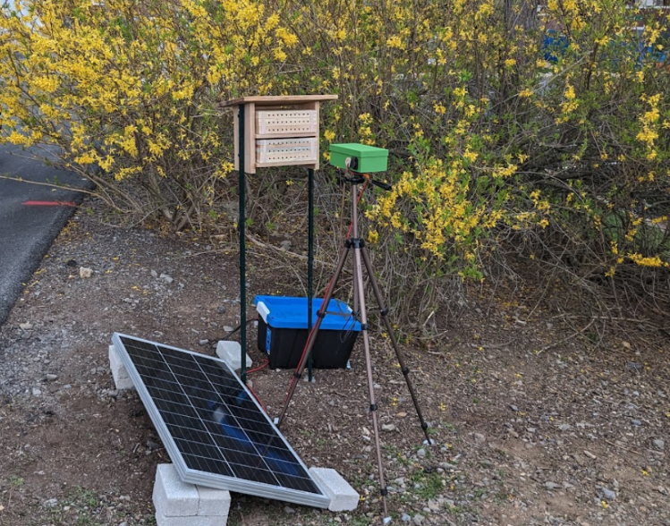

# BeeMonitor

**An open-source machine learning system for automated monitoring of cavity-nesting solitary bees**

[](https://www.python.org/downloads/)
[](https://github.com/ultralytics/ultralytics)

BeeMonitor is an integrated hardware and software system for automated video surveillance and AI-powered analysis of cavity-nesting solitary bee activity at bee hotels. The system extracts entry/exit events from nesting tubes without requiring individual bee marking.



## Performance

Evaluated on 110 minutes of video containing 300 manually annotated foraging events:

| Mode | Precision | Recall | F1 Score | Processing Speed |
|------|-----------|--------|----------|------------------|
| **Full Tracking** | 93.9% | 87.7% | **0.907** | 2.3× real-time |
| **Two-Mode Adaptive** | 92.0% | 84.3% | 0.880 | **0.8× real-time** |

*Benchmarked on Apple M3 Pro (18GB) with 4 parallel workers and MPS acceleration.*

## Features

### Software Pipeline
- **YOLO26 Object Detection** — End-to-end NMS-free detection with up to 43% faster CPU inference
- **BeeTrack MOT Algorithm** — Custom multiple-object tracking optimized for fast-moving insects
- **ML Event Classifier** — Random Forest classifier distinguishes real events from noise
- **Two-Mode Adaptive Processing** — Motion detection skips idle periods for 2.9× speedup
- **Batch Processing** — Parallel video processing with configurable workers

### Hardware System (~$595 USD)
- Raspberry Pi 4 + Witty Pi 4 power management
- Raspberry Pi HQ Camera (30 fps, 1080p)
- Solar panel + LiFePO4 battery for off-grid deployment
- Weatherproof 3D-printed enclosure

## Installation

### Requirements
- Python 3.10+
- macOS, Linux, or Windows
- GPU recommended (CUDA, MPS, or ROCm) but not required

### Install from Source

```bash
git clone https://github.com/eai6/BeeMonitor.git
cd beemonitor
pip install -e .
```

This installs all dependencies including PyTorch, Ultralytics, OpenCV, and scikit-learn.

### Verify Installation

```bash
python -c "from beemonitor import BeeMonitor; print('✓ BeeMonitor installed')"
```

## Quick Start

### Analyze a Single Video

```python
from beemonitor import BeeMonitor
from beemonitor.core.config import Config

# Load default configuration
config = Config.default()

# Initialize monitor
monitor = BeeMonitor(config=config)

# Analyze video
results = monitor.analyze_video(
    video_path="path/to/video.mp4",
    output_folder="output/"
)

# Access detected events
print(f"Detected {len(results.events)} events")
for event in results.events:
    print(f"  {event.action} at nest {event.nest} (frame {event.frame_number})")
```

### Batch Processing

```python
from beemonitor import BeeMonitor
from beemonitor.core.config import Config
from pathlib import Path
import concurrent.futures

config = Config.default()
video_folder = Path("videos/")
output_folder = Path("output/")

def process_video(video_path):
    monitor = BeeMonitor(config=config)  # Fresh instance per video
    return monitor.analyze_video(str(video_path), str(output_folder / video_path.stem))

videos = list(video_folder.glob("*.mp4"))

with concurrent.futures.ThreadPoolExecutor(max_workers=4) as executor:
    results = list(executor.map(process_video, videos))
```

## Algorithm Details

### YOLO26 Object Detection

BeeMonitor uses fine-tuned YOLO26 models for bee and nest detection. Key advantages of YOLO26:

- **End-to-end NMS-free inference** — No post-processing required, simplifying deployment
- **Up to 43% faster CPU inference** — Critical for edge devices like Raspberry Pi
- **Improved small object detection** — Better accuracy for fast-moving bees
- **Simplified export** — DFL removal improves compatibility across platforms

We fine-tuned separate models for:
1. **Nest detection** — Identifies 60-tube grid layout (runs once per video)
2. **Bee detection** — Locates bees in each frame (confidence threshold 0.25)

### BeeTrack MOT

BeeTrack is a tracking-by-detection algorithm optimized for fast-moving insects:

1. **Adaptive Kalman Filter** — Position prediction with velocity smoothing
2. **Hungarian Assignment** — Optimal detection-to-track association
3. **Track Lifecycle Management** — Handles occlusions with resurrection capability

Key innovations:
- **Adaptive thresholds** scale with detected bee size and video FPS
- **Distance clamping** prevents wild predictions during rapid direction changes
- **Track resurrection** recovers temporarily lost tracks within 0.5s window

### Two-Mode Adaptive Processing

```
┌─────────────────────────────────────────────────────────┐
│                    Motion Detection Mode                │
│  • Lightweight blob detection on ROI                    │
│  • Skip YOLO inference when no motion                   │
│  • Maintain 0.5s lookback buffer                        │
└─────────────────────────┬───────────────────────────────┘
                          │ Motion detected
                          ▼
┌─────────────────────────────────────────────────────────┐
│                    Full Tracking Mode                   │
│  • YOLO26 detection on full frame (NMS-free)            │
│  • BeeTrack MOT processing                              │
│  • Process lookback buffer first                        │
│  • 30-frame cooldown before returning to motion mode    │
└─────────────────────────────────────────────────────────┘
```

### ML Event Classification

The event classifier extracts 20 features from trajectory segments:

| Category | Features |
|----------|----------|
| **Trajectory Shape** | length, path_length, displacement, tortuosity |
| **Speed Profile** | avg, max, std, cv, start/middle/end speed, decel_ratio |
| **Nest Proximity** | start_to_nest, end_to_nest, approach_ratio |
| **Position Variance** | x_var, y_var |
| **Direction** | vertical_movement, horizontal_movement, is_entry |

## Hardware Setup

See [HARDWARE.md](hardware/README.md) for detailed assembly instructions.

## Citation

If you use BeeMonitor in your research, please cite:

```bibtex
@article{amoah2026beemonitor,
  title={BeeMonitor: Automated IoT video surveillance hardware and an AI-powered video processing software for monitoring the behavior of solitary, cavity-nesting bees},
  author={Amoah, Edward I.,Sanjel Santosh, Boyle Natalie K., and Grozinger Christina M.},
  year={2026},
  url={https://github.com/eai6/BeeMonitor.git}
}
```

## License

AGPL License. See [LICENSE](LICENSE) for details.

## Acknowledgements

- NSF Research Traineeship Program (INSECT NET, Grant 2243979)
- USDA NIFA Hatch and Smith-Lever Appropriations (Projects PEN04943, PEN08801)
- Penn State Joan Luerssen Faculty Enhancement Fund

## Contact

- **Author:** Edward Amoah
- **Email:** eai6@psu.edu
- **Lab:** [Grozinger Lab](https://www.grozingerlab.com/), INSECT-NET, Penn State University