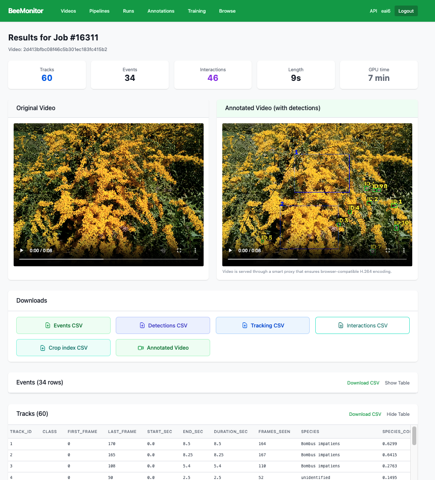
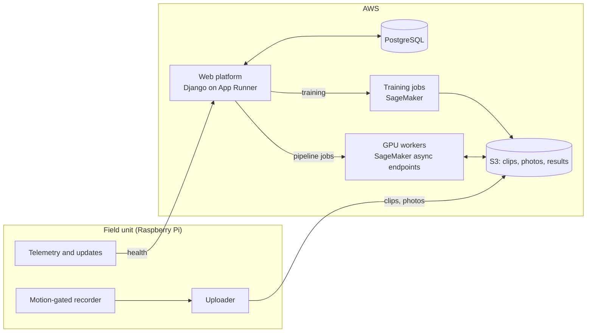

# BeeMonitor

**Open-source field hardware and a cloud platform for studying pollinator behaviour from video.**

[](https://github.com/eai6/BeeMonitor/actions/workflows/deploy.yml)
[](https://eai6.github.io/BeeMonitor/)
[](LICENSE)
[](https://www.biorxiv.org/content/10.64898/2026.07.10.737879v1)

**[Documentation](https://eai6.github.io/BeeMonitor/)** ·
**[Platform](https://beemonitor.edwardamoah.com)** ·
**[Preprint](https://www.biorxiv.org/content/10.64898/2026.07.10.737879v1)**


BeeMonitor started as a camera trap for bee hotels and grew into a general system. Field units built
from a Raspberry Pi record insects when they move and upload the clips. Clips and photos from any other
camera can be uploaded too. On the platform, researchers build computer-vision pipelines from blocks:
detect, track, identify species and individual bees, and measure behaviour. Results come out as tables
they can analyse in R or Python.


## What it does

- **Field units:** a Raspberry Pi with a high-resolution camera (Pi camera, 64 MP OwlSight or Luxonis OAK),
  on solar power or mains. It records when something moves inside a region you draw, and uploads over
  Wi-Fi or cellular. The units report their health and update their software remotely, and each one is
  enrolled with its own key.
- **Pipelines from blocks:** detection (fine-tuned YOLO, SAM 3 with a text prompt, or your own trained
  model), multi-object tracking (BeeTrack, ByteTrack, BoT-SORT, OC-SORT or SFSORT), species ID (BeeMachine
  or BioCLIP, by vote over every crop of a track), marker reading for individual bees, and behaviour
  measured against reference objects such as nest tubes, flowers or pollen tubes.
- **Behaviour as two tables:** *events* (something entered or left something) and *interactions* (two
  things were together for a while), plus one row per track with its species and marker. Foraging trips,
  flower visits and the results of lab assays are all computed from these tables.
- **Photos as well as video:** large photos are split into tiles so small insects aren't lost, and each
  insect gets a crop and a species.
- **Annotation and training:** sample the busiest frames of each clip, pre-label them with SAM 3, review
  them as a team, then fine-tune a detector and use it in a pipeline. Datasets and models can be
  published for others to copy.
- **REST API:** upload, run pipelines and fetch results from a notebook.



## Architecture


```mermaid
flowchart LR
  subgraph Field["Field unit (Raspberry Pi)"]
    R[Motion-gated recorder] --> UP[Uploader]
    T[Telemetry and updates]
  end
  subgraph AWS
    W["Web platform<br/>Django on App Runner"]
    S[(S3: clips, photos, results)]
    DB[(PostgreSQL)]
    G["GPU workers<br/>SageMaker async endpoints"]
    TR["Training jobs<br/>SageMaker"]
  end
  UP -- clips, photos --> S
  T -- health --> W
  W <--> DB
  W -- pipeline jobs --> G
  G <--> S
  W -- training --> TR
  TR --> S
```

- **Web platform** (`beemonitor_web/`): Django and Django REST Framework. It covers devices, uploads
  (resumable multipart to S3), the pipeline editor and its execution engine, annotation, training,
  publishing and the API.
- **GPU workers** (`sagemaker_backend/`): Docker images for SageMaker asynchronous inference. One endpoint
  runs detection, tracking, species ID, photo detection and transcoding; another runs SAM 3. Both scale
  to zero when idle.
- **Analysis engine** (`src/beemonitor/`): the Python package that does the detection, tracking and
  event work. The GPU workers run it, and you can also use it on its own.
- **Infrastructure** (`infra/`): Pulumi for the whole AWS stack. GitHub Actions run the tests, build and
  push images, deploy the web app, publish signed device updates and build these docs.

## Repository map

| Folder | What it is |
|---|---|
| [`hardware/`](hardware/) | Device software: recording, uploader, telemetry, enrolment, remote updates, cellular; enclosure and bill of materials |
| [`src/beemonitor/`](src/) | Analysis engine (Python package): detection, BeeTrack and other trackers, event classifier, species ID |
| [`beemonitor_web/`](beemonitor_web/) | The web platform (Django) |
| [`sagemaker_backend/`](sagemaker_backend/) | GPU worker images and the training container |
| [`cloud/`](cloud/) | The wrapper the GPU worker runs: storage, ingestion, result packaging |
| [`infra/`](infra/) | Infrastructure as code (Pulumi, AWS) |
| [`desktop/`](desktop/) | Offline desktop app for analysing bee-hotel videos without the cloud (PyQt6) |
| [`models/`](models/) | Released weights: bee detector, nest detector, entry/exit classifier |
| [`research/`](research/) | Data and notebooks behind the preprint |
| [`docs/`](docs/) | The documentation site (MkDocs Material) |
| [`memory/`](memory/) | Design notes: one per feature, with the problem, options, decision and plan |
| [`examples/`](examples/) | Two short sample clips |
| [`scripts/`](scripts/) | Tools for training the event classifier and for camera setup |

## Quick start

**Use the platform.** Sign up at [beemonitor.edwardamoah.com](https://beemonitor.edwardamoah.com), upload
a clip, and run a template pipeline. See [Get started](https://eai6.github.io/BeeMonitor/get-started/).

**Build a unit.** Parts, costs and a ten-step assembly guide with a printable manual:
[Build a unit](https://eai6.github.io/BeeMonitor/hardware/).

**Run the analysis engine locally** (Python 3.10+):

```bash
git clone https://github.com/eai6/BeeMonitor.git && cd BeeMonitor
pip install torch torchvision --index-url https://download.pytorch.org/whl/cpu   # or a CUDA build
pip install -e .
```

```python
from beemonitor import BeeMonitor
from beemonitor.core.config import Config

monitor = BeeMonitor(config=Config.default())
results = monitor.analyze_video("examples/mendels_2024-05-08_15_57_03.mp4",
                                output_folder="output/")
print(results.events)   # one row per entry or exit, with the nest and the frame
```

More in [`src/README.md`](src/README.md).

## Accuracy

Validated on bee hotels against 110 minutes of video with 300 hand-annotated foraging events
([preprint](https://www.biorxiv.org/content/10.64898/2026.07.10.737879v1)):

| Mode | Precision | Recall | F1 |
|---|---|---|---|
| Full tracking | 93.9% | 87.7% | 0.907 |
| Two-mode adaptive | 92.0% | 84.3% | 0.880 |

## Development

```bash
# Analysis engine
PYTHONPATH=src python -m pytest src/beemonitor/tests

# Web platform
cd beemonitor_web && pip install -r requirements/development.txt
DJANGO_SETTINGS_MODULE=config.settings.development python manage.py test

# Docs
pip install -r docs/requirements.txt && mkdocs serve
```

Every push to `main` runs the engine, worker and web test suites before anything deploys.

## Citation

```bibtex
@article{amoah2026beemonitor,
  title={BeeMonitor: Automated IoT video surveillance hardware and an AI-powered video processing software for monitoring the behavior of solitary, cavity-nesting bees},
  author={Amoah, Edward I. and Sanjel, Santosh and Boyle, Natalie K. and Grozinger, Christina M.},
  journal={bioRxiv},
  year={2026},
  doi={10.64898/2026.07.10.737879},
  url={https://www.biorxiv.org/content/10.64898/2026.07.10.737879v1}
}
```

## License

[AGPL-3.0](LICENSE): the hardware designs, device software, platform and analysis code.

## Acknowledgements

NSF Research Traineeship Program (INSECT NET, Grant 2243979) · USDA NIFA Hatch and Smith-Lever
Appropriations (PEN04943, PEN08801) · Penn State Joan Luerssen Faculty Enhancement Fund.

## Contact

Edward Amoah · [eai6@psu.edu](mailto:eai6@psu.edu) ·
[Grozinger Lab](https://www.grozingerlab.com/), Penn State University ·
[Issues](https://github.com/eai6/BeeMonitor/issues)
