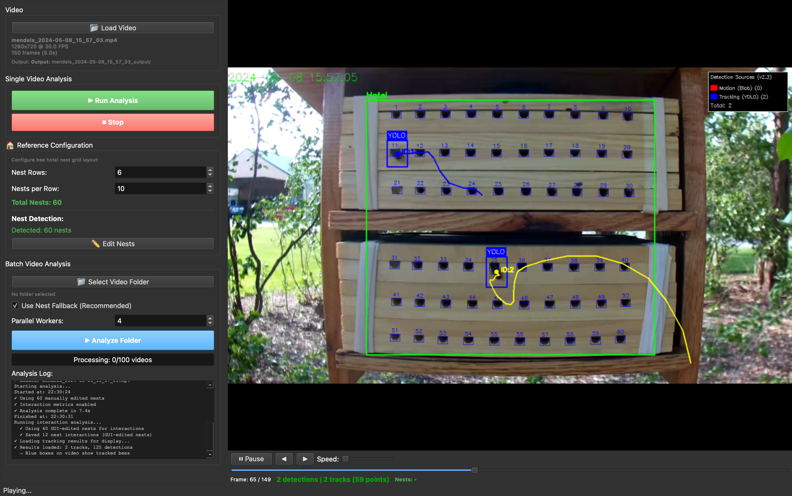

# BeeMonitor Desktop Application

**AI-powered video analysis GUI for automated bee monitoring**

Version 1.0.0

## Overview

The BeeMonitor Desktop Application provides a user-friendly interface for analyzing bee hotel videos to detect and track bee nesting behavior. The application processes recorded videos to automatically identify entry/exit events at nesting tubes without requiring programming expertise.



### Key Features

- **Video Player Interface**: Frame-by-frame navigation with playback controls
- **Automated Analysis**: One-click processing with YOLO detection + adaptive tracking
- **Nest Editor**: Interactive grid configuration for bee hotel layouts
- **Detection Visualization**: Real-time overlay of tracked bees and nest zones
- **Batch Processing**: Analyze multiple videos in parallel
- **Results Export**: CSV files with entry/exit events and trajectory data
- **Performance Metrics**: Detailed analysis statistics and processing times

## Installation

### Prerequisites

- Python 3.10 or higher
- BeeMonitor package (core analysis engine)
- PyQt6 (GUI framework)

### Step 1: Install BeeMonitor Core Package

First, install the BeeMonitor analysis package:

```bash
git clone https://github.com/eai6/BeeMonitor.git
cd beemonitor
pip install -e .
```

### Step 2: Install GUI Dependencies

The desktop application requires additional packages not included in the default BeeMonitor installation:

```bash
pip install PyQt6 PyQt6-QtMultimedia
```

**Note**: On some systems you may need to use `pip3` instead of `pip`.

### Step 3: Verify Installation

Test the installation:

```bash
python -c "from PyQt6.QtWidgets import QApplication; print('PyQt6 OK')"
python -c "import beemonitor; print(f'BeeMonitor {beemonitor.__version__} OK')"
```

## Running the Application

### Launch GUI

```bash
python desktop/run_gui.py
```

### Basic Workflow

1. **Load Video**: File → Open Video or drag-and-drop
2. **Configure Nests**: Tools → Edit Nest Grid (set rows/columns, adjust positions)
3. **Run Analysis**: Click "Analyze Video" button
4. **Review Results**: Browse detections, export CSV

## System Requirements

### Minimum

- **OS**: Windows 10/11, macOS 10.15+, or Linux
- **RAM**: 8 GB
- **Storage**: 2 GB free space
- **CPU**: Dual-core processor

### Recommended

- **RAM**: 16 GB or more
- **CPU**: Apple M-series chip or Intel i7/Ryzen 7
- **GPU**: For YOLO acceleration (CUDA-compatible for NVIDIA, MPS for Apple Silicon)

### Performance Notes

- 10-minute 1080p video: ~8 minutes processing time (M3 Pro laptop)
- Real-time performance possible on recommended hardware
- GPU acceleration provides 2-5x speedup over CPU-only

## Configuration Files

The application uses these configuration files in the core package

### `scr/core/config.py`

## Troubleshooting

### PyQt6 Import Error

```bash
# Try installing with system package manager
# Ubuntu/Debian:
sudo apt install python3-pyqt6

# macOS (Homebrew):
brew install pyqt@6
```

### Video Codec Issues

If videos won't load:
```bash
pip install opencv-python-headless
```

### Performance Issues

- Reduce video resolution (720p works well)
- Close other applications to free RAM
- Enable GPU acceleration in Model Settings

### Missing Dependencies

Ensure all packages are installed:
```bash
pip install beemonitor PyQt6 opencv-python numpy pandas
```

---

## Advanced Usage

### Batch Processing

Process multiple videos:
1. File → Analyze Folder
2. Select folder containing videos
3. Configure parallel workers (default: 4)

### Custom Detection Models

1. Tools → Model Settings
2. Set custom YOLO weights path

## File Structure

```
beemonitor_gui/
├── __init__.py              # Package initialization
├── main_window.py           # Main application window
├── control_panel.py         # Analysis controls
├── video_panel.py           # Video playback widget
├── video_canvas.py          # Video display with overlays
├── nest_editor_dialog.py    # Interactive nest configuration
├── analysis_thread.py       # Background processing
├── detection_visualizer.py  # Overlay rendering
├── model_settings_dialog.py # YOLO configuration
├── dialogs.py              # Helper dialogs
├── constants.py            # Application constants
└── utils.py                # Utility functions

run_gui.py                   # Application entry point
```

### Dependencies

- **PyQt6**: GUI framework
- **opencv-python**: Video I/O and processing
- **numpy**: Numerical operations
- **pandas**: Data export
- **beemonitor**: Core analysis package

## Support

- **Author:** Edward Amoah
- **Email:** eai6@psu.edu
- **Lab:** [Grozinger Lab](https://www.grozingerlab.com/), INSECT-NET, Penn State University


