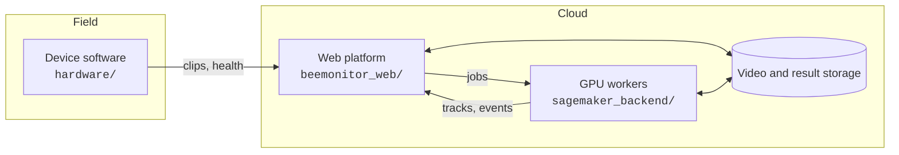

# About

## Open source

Everything is in one repository, [github.com/eai6/BeeMonitor](https://github.com/eai6/BeeMonitor), under
[AGPLv3](#license-citation): the hardware, the device software, the analysis code, the web platform and
these docs.



### Components

| Folder | What it is | Built with |
|---|---|---|
| `hardware/` | Device software: motion-gated recording, uploader, health telemetry, enrolment, updates, cellular; BOM and enclosure STLs in `hardware/enclosure/` | Python, picamera2 / DepthAI, systemd |
| `src/beemonitor/` | The core analysis engine: detection, BeeTrack tracking, event classification, outputs. Usable on its own as a Python package | Python, Ultralytics YOLO, OpenCV |
| `beemonitor_web/` | The platform: devices, Processing, the pipeline builder and engine, annotation, training, publishing, the API | Django, PostgreSQL, Tailwind |
| `sagemaker_backend/` | GPU workers: detection + tracking, SAM 3 sampling and labelling, BeeMachine species ID, model training | Docker, PyTorch, AWS SageMaker |
| `cloud/` | Storage and ingestion connectors (S3, GCS, Google Drive) | Python |
| `models/` | Model weights: bee detector, nest detector, entry/exit classifier | |
| `infra/` | Cloud infrastructure as code | Pulumi (AWS) |
| `docs/` | This site | MkDocs Material |

### Running parts of it yourself

- **Analyse videos offline**: the `beemonitor` Python package runs detection, tracking and entry/exit events
  on your own machine (a GPU helps).
- **Use the hosted platform**: [beemonitor.edwardamoah.com](https://beemonitor.edwardamoah.com). Units,
  pipelines, annotation and training all run there.
- **Self-host the platform**: the code and the infrastructure definitions are all in the repository, but a
  step-by-step self-hosting guide isn't written yet. Open an
  [issue](https://github.com/eai6/BeeMonitor/issues) if you plan to do this.

## Contributing

Contributions are welcome, including new study setups, hardware variants, models, bug fixes and better docs.

### Ways to help

- **Report a problem or ask a question**: [open an issue](https://github.com/eai6/BeeMonitor/issues). For a
  unit, include the camera, the Pi model and what the device page shows under Health.
- **Share a setup**: if you used BeeMonitor for a new kind of study, open an issue describing the camera
  setup, the reference and how you read the tables, so others can reuse it.
- **Share data and models**: [publish](platform/annotation.md#publish) a labelled project or a trained model
  so others can build on it.
- **Improve the docs**: every page has an edit button (the pencil, top right) that opens the Markdown source
  on GitHub.
- **Code and hardware**: fork the repository, make your change on a branch and open a pull request. Keep a
  change to one thing, and describe how you tested it.

### Docs locally

```bash
pip install -r docs/requirements.txt
mkdocs serve        # http://127.0.0.1:8000
```

The site rebuilds and publishes when `docs/` changes on `main`.

### Licence of contributions

By contributing you agree that your contribution is licensed under the project's
[AGPLv3](#license-citation).

## How it works

### On the device: motion-gated recording

The camera writes video into a short buffer all the time. A small 640×480 copy of each frame goes through
background subtraction (MOG2). When insect-sized blobs move inside the ROI, the buffer and what follows are
saved as a clip, which ends 5 s after the motion stops. A daily calibration measures the insects in your own
clips to tune the blob sizes. Because the unit records only when something is active, it saves 10–100×
less data, which makes uploading practical.

### In the cloud: detection and tracking

- **Detection**: fine-tuned YOLO26 models find each class you ask for (bees, nest tubes, other insects) in
  every frame. SAM 3 detects classes from a text prompt when no trained model exists yet.
- **Tracking**: BeeTrack follows each animal. A Kalman filter predicts where it goes, the Hungarian algorithm
  matches detections to tracks, and a lost track can be recovered within 0.5 s.
- **Species**: BeeMachine (354 bee taxa) classifies every frame of a track and takes the majority vote.
- **Two-mode processing**: lightweight motion detection skips idle stretches, and full tracking runs only
  when something moves (2.9× faster).

### From tracks to behaviour

One pass over the tracks and the [reference](get-started.md#2-run-a-pipeline) finds **episodes**: the
contiguous runs of frames in which a track is inside a reference or near another track. A short gap
(15 frames by default) doesn't break an episode. Each episode becomes an **interaction**, and its start and
end become **enter** and **exit** events. Because both tables come from the same pass, they always agree.

At nest tubes, a Random Forest classifier also judges entries and exits. It uses 20 features of each track
near a tube (shape, speed, distance to the nest, direction) to separate real entries and exits from bees
that just walk past. Those rows are marked `source = gpu`.

### Accuracy

Validated on bee hotels: on 110 minutes of video with 300 hand-annotated foraging events, precision was
93.9%, recall 87.7% and F1 0.907 (full tracking). Other setups (flowers, lab assays) use the same detection and tracking but
haven't been validated separately yet. Check a sample of your own results before relying on them.

## Glossary

**Unit / device**: a BeeMonitor recording module (Raspberry Pi, camera, enclosure) enrolled on your account.

**Video / clip**: one recording. A unit cuts its recordings into clips, one per burst of motion or one every
10 minutes in continuous mode.

**Site**: where a video was recorded. Set from the device's location, or by you when uploading.

**ROI (region of interest)**: the part of the picture that matters. On a unit, motion only starts a
recording inside the ROI.

**Reference / reference object**: what behaviour is measured against, such as a nest tube, a flower or a
drawn region.

**Layout**: a device's ROI plus its reference objects. Every change is kept as a new version, so older clips
are analysed with the layout they were recorded with.

**Detection**: one box around one object in one frame.

**Track**: the detections of one animal linked across frames, with an id that is valid within its clip.

**Event**: a track entering or exiting a reference at a moment.

**Interaction / episode**: two things (two tracks, or a track and a reference) together for a span of time.

**Foraging trip**: an exit from a nest tube followed by the next entry into the same tube.

**Visit**: an interaction between a track and a reference.

**Dwell time**: the duration of a visit.

**Pipeline**: a reusable graph of steps. A **run** is one pipeline applied to one clip, and a **batch** is
the same pipeline run on many clips.

**Annotation project**: frames and boxes you label to train a model.

## License & citation

BeeMonitor — code, hardware designs and this documentation — is licensed under the
[GNU Affero General Public License v3.0](https://github.com/eai6/BeeMonitor/blob/main/LICENSE) (AGPLv3),
the same licence as the Ultralytics YOLO it builds on.

### Cite

If you use BeeMonitor in your research, please cite:

```bibtex
@article{amoah2026beemonitor,
  title={BeeMonitor: Automated IoT video surveillance hardware and an AI-powered video processing software for monitoring the behavior of solitary, cavity-nesting bees},
  author={Amoah, Edward I. and Sanjel, Santosh and Boyle, Natalie K. and Grozinger, Christina M.},
  year={2026},
  url={https://github.com/eai6/BeeMonitor}
}
```

### Contact

Edward Amoah — eai6@psu.edu · [Issues on GitHub](https://github.com/eai6/BeeMonitor/issues)
