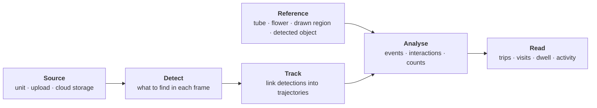

# The architecture

BeeMonitor has no separate code for each kind of study. A nest hotel, a flower and a petri dish all go
through the same four stages, and only the configuration changes.

## 1. Sources: where video comes from

A **video** is any clip on the platform, wherever it came from:

- a [BeeMonitor unit](../hardware/index.md), which records when something moves and uploads the clips itself;
- an [upload](../platform/sources.md) from any camera or phone;
- a connected bucket or folder (AWS S3, Google Cloud Storage, Google Drive);
- the [API](../platform/api.md), for example from a notebook.

Each video has a site and a recording time. Videos from a unit also carry that unit's layout (its ROI and
reference objects), saved as a version at the moment the clip was recorded.

## 2. Detect and track

**Detect** finds one class of thing in each frame, such as a bee, a wasp or a nest tube. You can use a fast
YOLO model (the built-in ones, or [one you trained](../platform/annotation.md)) or SAM 3 with a text prompt
for classes nobody has trained a model on yet. Use one Detect step per class.

**Track** (multi-object tracking, BeeTrack by default) links the detections of each animal from frame to
frame into a **track** with an id. **Identify species** and **Read marker** then label whole tracks rather
than single frames.

## 3. The reference

Behaviour is measured *against something*. That something is the **reference**:

| Reference | Typical use |
|---|---|
| The device's saved layout: the ROI and the nest tubes drawn on the device page | Nest hotels |
| Regions you draw in the pipeline | A flower, a patch, an arena zone, a feeder |
| A second Detect step, such as detecting the nest tubes in each video | Hotels without a saved layout, objects that move |

## 4. Analyse: two primitives

Every question is answered from two tables (see [Events & interactions](results.md)):

- **Event**: *something entered or exited something*, at a moment. A bee entering tube 3 at 12.4 s.
- **Interaction**: *two things were together for a span of time*. A bee was on the flower from 3.0 s to
  9.5 s, or two bees were within a set distance of each other for 1.2 s.

Both come from one pass over the tracks. An interaction's start and end *are* its enter and exit events,
so the two tables always agree.

A third, simpler measure, **Detection count**, answers "how much was there" without asking who went
where: totals, distinct objects, or counts binned over time.

## 5. Read: your question

Foraging trips, time on a flower, time in an assay zone, encounters: each is a filter and group-by over
events or interactions, done on the platform or in your own spreadsheet, R or pandas. See
[From the tables to your question](results.md#from-the-tables-to-your-question).

**Next:** [Pipelines and steps](pipelines.md)
