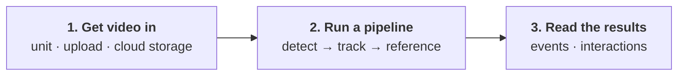

# Get started

Every study in BeeMonitor follows the same three steps, whether you film a nest hotel, a flower or an arena in
the lab.

## 1. Get video in

You need an account on [beemonitor.edwardamoah.com](https://beemonitor.edwardamoah.com). Then either:

- **Build a BeeMonitor unit** ([Build](hardware/build.md), [Set up & deploy](hardware/setup.md)). It records
  only when insects are active, uploads the clips itself, and lets you control it remotely.
- **Use video you already have** from any camera: upload it, or connect S3, Google Cloud Storage or Google
  Drive ([Videos](platform/videos.md)).

## 2. Run a pipeline

A pipeline takes each clip through the same stages:

- **Detect** finds what you study in every frame, such as bees, wasps or flies. Use a built-in model,
  [your own](platform/annotation.md), or SAM 3 with a text prompt.
- **Track** links the detections of each animal from frame to frame.
- **Reference** is what behaviour is measured against: the nest tubes drawn on a unit, regions you draw
  (a flower, an arena zone), or objects detected in the video.

Start from a template under **Pipelines** and run it from **Processing** on the clips you choose
([Pipelines](platform/pipelines.md)).

## 3. Read the results

Every pipeline writes two tables:

- **Events**: something entered or exited something. *A bee left tube 3 at 12.4 s.*
- **Interactions**: two things were together for a while. *A bee was on the flower from 3.0 s to 9.5 s.*

Your question is a read over them: foraging trips come from events, and visits, time on a flower or time in
an assay zone come from interactions ([Results](platform/results.md)).
