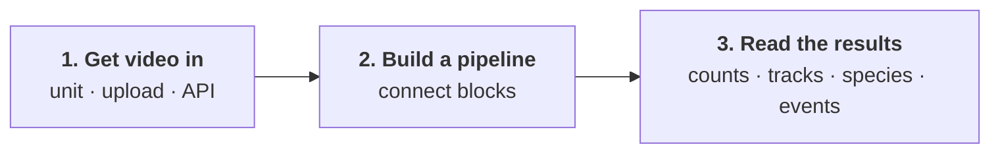
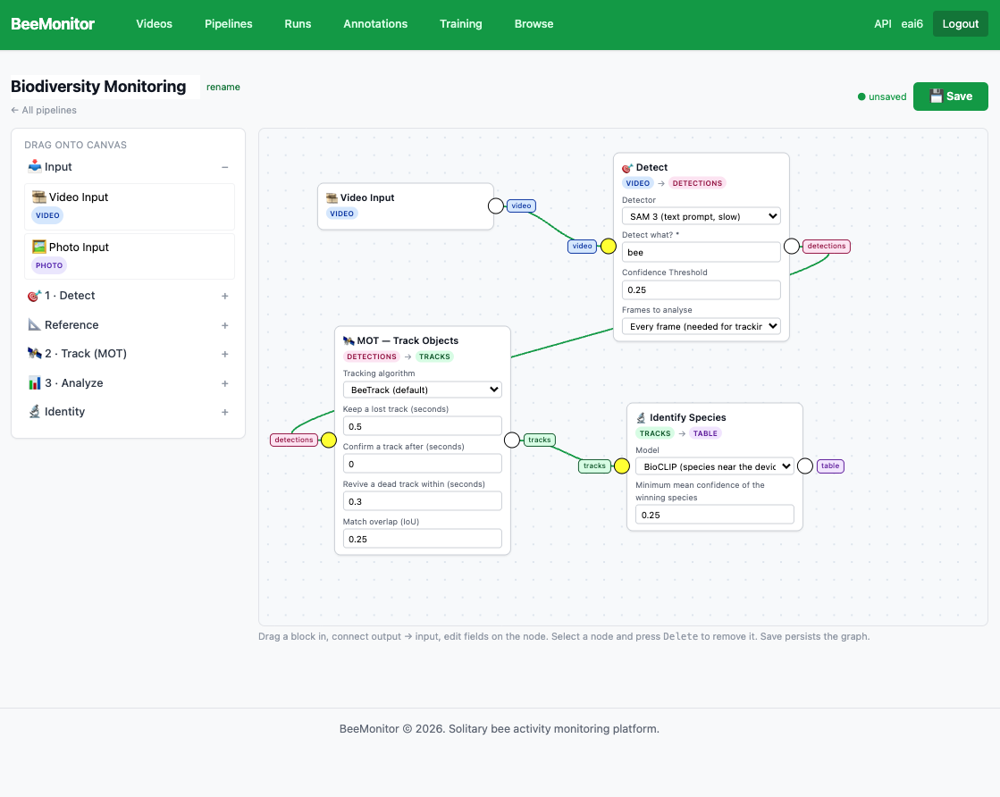

# Get started

Every study follows the same three steps, whether you film a nest hotel, a flower or an arena in
the lab.

## 1. Get video in

You need an account on [beemonitor.edwardamoah.com](https://beemonitor.edwardamoah.com). Then either:

- **Build a BeeMonitor unit** ([Build a unit](hardware/index.md)), then add it on the platform's [Add a device](https://beemonitor.edwardamoah.com/devices/enrollment) page. It records
  only when insects are active, uploads the clips itself, and lets you control it remotely.
- **Use video you already have** from any camera: **Videos → Upload videos**, any size, with an
  optional site and recording time ([Videos](platform/videos.md#upload-from-any-camera)), or through the
  [API](platform/api.md).

## 2. Build a pipeline

A pipeline is a computer-vision analysis you assemble from blocks in the **Pipelines** editor: drag blocks
onto the canvas and connect each block's output to the next block's input. Use as few or as many as your
question needs.

<figure markdown>
  
  <figcaption>A biodiversity-monitoring pipeline: detect bees, track them, and name each track's species.</figcaption>
</figure>

| Block | What it does |
|---|---|
| **Input** | What the pipeline runs on: a **Video Input** (clips) or a **Photo Input** (unit photos and uploaded JPEG, PNG, TIFF, HEIC). |
| **Detect** | Finds one kind of thing in the frames (bees, wasps, flies, flowers, nest tubes) with a built-in model, [your own](platform/training.md), or SAM 3 with a text prompt. Every frame, or a sample of frames for things that don't move. |
| **Reference** | What behaviour is measured against: the device's saved ROI and reference objects (nest tubes, flowers, pollen tubes), or objects a detector finds in the video. |
| **Track** | Links each animal's detections from frame to frame. Choose the tracker (BeeTrack, ByteTrack, BoT-SORT, OC-SORT, SFSORT) and tune it. |
| **Analyze** | Turns detections or tracks into numbers: detection counts (totals, distinct objects, over time), events (enter / exit) and interactions (visits, encounters, dwell time). |
| **Identity** | Names each track: its species (BeeMachine or BioCLIP) and, for marked bees, its individual ID. Every crop of the track votes. |

Some of the pipelines this makes:

| You want | Blocks |
|---|---|
| How many insects are in each photo, and which species | Photo Input → Detect → Analyze: detection count, + Identity: species |
| How many insects are there in a clip | Video Input → Detect → Analyze: detection count |
| What species is each insect that passes (biodiversity monitoring) | Input → Detect → Track → Identity: species |
| Foraging trips at a nest hotel | Input → Detect → Track → Reference (the unit's tubes) → Analyze: events |
| Visits and time on each flower, or each zone of an assay | Input → Detect → Track → Reference (saved layout, or Detect) → Analyze: interactions |
| Which marked bee did what | Input → Detect → Track → Identity: marker, plus any of the above |

On photos, Detect, Reference, Detection count and Identity work; tracking and everything built on it need
a video, and the editor says so. Large photos (a 64 MP unit photo) are cut into overlapping tiles for
detection automatically, so a small bee is still found.

Start from a template or from scratch, save it, then run it from **Videos** on the clips (or, under
**Photos**, the photos) you choose, or on everything new from a unit on a schedule
([Pipelines](platform/pipelines.md)).

## 3. Read the results

Each block adds what it measured to the run, as a table you can view and download as CSV: counts per clip
or over time, tracks, species and IDs per track, events and interactions.

Pipelines that track animals against a reference produce two tables that answer most behavioural questions:

- **Events**: something entered or exited something. *A bee left tube 3 at 12.4 s.*
- **Interactions**: two things were together for a while. *A bee was on the flower from 3.0 s to 9.5 s.*

Each row names a track, and the tracking table gives every track its **species** and, for marked bees,
its **individual ID**. Join them on the track and you have what each animal did *and* what it was and which
one: *a* Bombus impatiens *(individual red-blue) left tube 3 at 12.4 s.* Foraging trips come from events;
visits and time on a flower or in an assay zone come from interactions, by species or by individual
([Runs](platform/runs.md#the-tables)).
