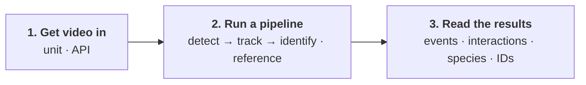

# Get started

Every study follows the same three steps, whether you film a nest hotel, a flower or an arena in
the lab.

## 1. Get video in

You need an account on [beemonitor.edwardamoah.com](https://beemonitor.edwardamoah.com). Then either:

- **Build a BeeMonitor unit** ([Build a unit](hardware/index.md)), then add it on the platform's [Add a device](https://beemonitor.edwardamoah.com/devices/enrollment) page. It records
  only when insects are active, uploads the clips itself, and lets you control it remotely.
- **Use video you already have** from any camera: **Processing → Upload videos**, any size, with an
  optional site and recording time ([Videos](platform/videos.md#upload-from-any-camera)), or through the
  [API](platform/api.md).

## 2. Run a pipeline

A pipeline takes each clip through the same stages:

- **Detect** finds what you study in every frame, such as bees, wasps or flies. Use a built-in model,
  [your own](platform/annotation.md), or SAM 3 with a text prompt.
- **Track** links the detections of each animal from frame to frame. Choose the tracker (BeeTrack,
  ByteTrack, BoT-SORT, OC-SORT or SFSORT) and tune it.
- **Identify** names each track: its **species** (BeeMachine or BioCLIP) and, for marked bees, its
  **individual ID** from the paint mark. Every crop of the track votes; the track takes the winner.
- **Reference** is what behaviour is measured against: the nest tubes drawn on a unit, regions you draw
  (a flower, an arena zone), or objects detected in the video.

Start from a template under **Pipelines** and run it from **Processing** on the clips you choose
([Pipelines](platform/pipelines.md)).

## 3. Read the results

Every pipeline writes two tables:

- **Events**: something entered or exited something. *A bee left tube 3 at 12.4 s.*
- **Interactions**: two things were together for a while. *A bee was on the flower from 3.0 s to 9.5 s.*

Each row names a track, and the tracking table gives every track its **species** and, for marked bees,
its **individual ID**. Join the two on the track and you have what each animal did relative to the
reference *and* what it was and which one: *a* Bombus impatiens *(individual red-blue) left tube 3 at
12.4 s.*

Your question is a read over them: foraging trips come from events, and visits, time on a flower or time in
an assay zone come from interactions, by species or by individual ([Results](platform/results.md)).
