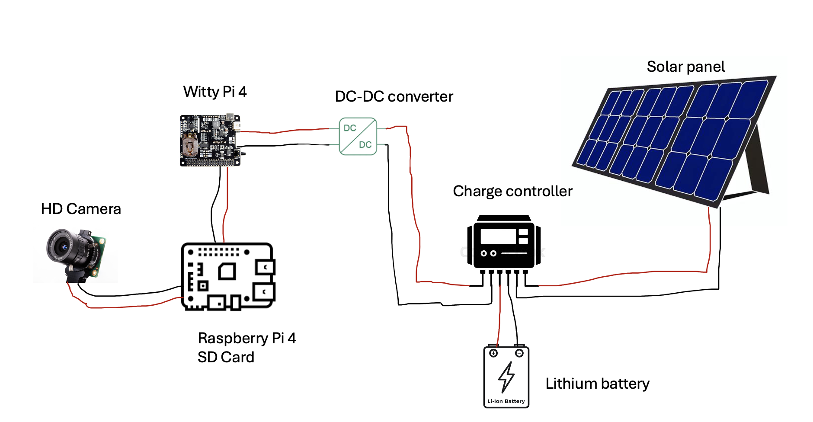
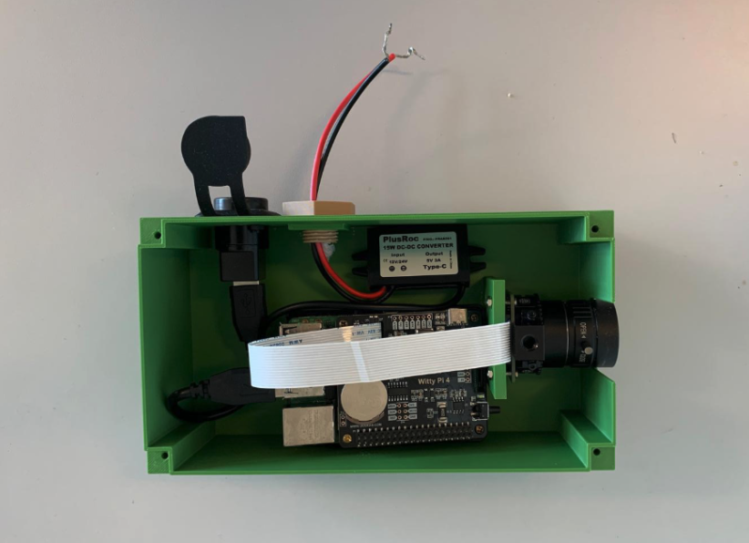
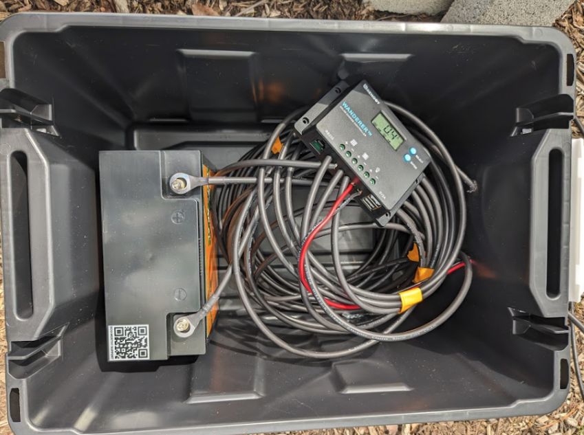

# Build a unit

A BeeMonitor unit is a camera that records only when insects are active and uploads the clips. It works at
a nest hotel, by a flower patch or on a lab bench. You don't need one to use the platform, because
[uploaded video](../platform/videos.md#getting-video-in) works too, but a unit gives you motion-triggered recording,
remote control and saved layouts.

A BeeMonitor unit has two parts:

- **Recording module** (~$350) — a Raspberry Pi 4, a camera and a Witty Pi 4 in a 3D-printed enclosure.
  It records only when something moves and uploads the clips.
- **Energy module** (~$245, optional) — a solar panel, charge controller and battery for sites without mains power.

## Choose a configuration

| | Options |
|---|---|
| **Computer** | Raspberry Pi 4, **2 GB or more** (4 GB recommended). A 1 GB Pi records fine but can't take 64 MP photo bursts. |
| **Camera** | Raspberry Pi HQ camera (12 MP, 1080p video) · Arducam 64 MP OwlSight (autofocus, 64 MP photos) · Luxonis OAK-1-AF (USB, autofocus, 12 MP video and photos) |
| **Power** | Mains (USB-C) · Solar panel + battery (energy module) |
| **Connection** | WiFi · WiFi + 4G (Sixfab LTE HAT) for remote sites |

!!! tip
    Start with mains power and WiFi on your bench. Add solar and 4G once the unit records well.

## Parts

Prices are estimates in USD. Equivalent parts work.

### Recording module (~$350)

| Component | Specification | Price |
|---|---|---|
| [Raspberry Pi 4 Model B](https://www.amazon.com/dp/B07TC2BK1X) | 4 GB RAM | $70 |
| [Witty Pi 4](https://www.adafruit.com/product/5704) | Power schedule and real-time clock | $40 |
| [Raspberry Pi HQ Camera](https://www.amazon.com/dp/B08LHJR3K4) | IMX477, 12.3 MP — or a [camera option](#choose-a-configuration) | $75 |
| [CS-mount lens](https://www.amazon.com/dp/B088GWZPL1) | 6 mm (HQ camera only) | $25 |
| [microSD card](https://www.amazon.com/dp/B07FCR3316) | 256 GB | $30 |
| [DC-DC buck converter](https://www.amazon.com/dp/B09DGDQ48H) | 12 V to 5 V, 3 A or more | $10 |
| [Waterproof USB-C connector](https://www.amazon.com/dp/B091TMHVSS) | Panel mount | $10 |
| [USB cable](https://www.amazon.com/dp/B07BZ2M3WM) | Male A to male A, short | $10 |
| [Enclosure](#enclosure) | 3D printed, PETG | ~$50 |
| [Tripod](https://www.amazon.com/dp/B00XI87KV8) | 50 inch | $20 |
| [Mounting hardware](https://www.amazon.com/dp/B0F6MNBQVL) | M2.5 standoffs, screws, cable glands | $10 |

### Energy module (~$245, optional)

| Component | Specification | Price |
|---|---|---|
| [Solar panel kit](https://www.amazon.com/dp/B00BFCNFRM) | Renogy 100 W 12 V, with charge controller | $120 |
| [Battery](https://www.amazon.com/dp/B09N9BBS68) | 12 V 30 Ah LiFePO4 | $80 |
| Battery box | Waterproof toolbox | $30 |
| [Wire](https://www.amazon.com/dp/B07SG23DT1) | 16 gauge | $15 |

### 4G (optional)

A Sixfab 4G LTE HAT and SIM. Without it the unit uploads only on WiFi.

## Enclosure

Print these four parts. The files are in
[`hardware/enclosure`](https://github.com/eai6/BeeMonitor/tree/main/hardware/enclosure).

| Part | File |
|---|---|
| Body — holds the Pi, Witty Pi and converter | [enclosure_body.stl](https://github.com/eai6/BeeMonitor/raw/main/hardware/enclosure/enclosure_body.stl) |
| Lid — with the camera window | [enclosure_lid.stl](https://github.com/eai6/BeeMonitor/raw/main/hardware/enclosure/enclosure_lid.stl) |
| Tripod connector | [enclosure_tripod_connector.stl](https://github.com/eai6/BeeMonitor/raw/main/hardware/enclosure/enclosure_tripod_connector.stl) |
| Power cable connector | [power_cable_connector.stl](https://github.com/eai6/BeeMonitor/raw/main/hardware/enclosure/power_cable_connector.stl) |

<!-- PHOTO: the four printed parts laid out -->

### Print settings

| Setting | Value |
|---|---|
| Material | PETG (UV resistant) or PLA |
| Layer height | 0.2 mm |
| Infill | 20% |
| Walls | 3 |
| Supports | Yes |
| Bed adhesion | Brim |

About 8–12 hours in total.

## Assembly

### Recording module

1. Screw the **Raspberry Pi** onto the standoffs in the enclosure body.
2. Press the **Witty Pi 4** onto the Pi's GPIO header. Line up all 40 pins.
3. Connect the **camera**:

    === "HQ camera / 64 MP OwlSight"
        Lift the latch of the Pi's camera port, insert the ribbon with the contacts facing the HDMI
        ports, and press the latch down. Mount the camera in the lid's window.

    === "Luxonis OAK-1-AF"
        Plug the OAK into a **blue (USB 3)** port. Mount it in the lid's window the right way up —
        the OAK can't flip its picture.

4. Mount the **DC-DC converter** in the body and wire its 5 V output to the Witty Pi's power input.
5. Run the power cable through the cable gland and tighten it.
6. Fit the lid, but don't seal it until the unit records well ([Set up a unit](setup.md)).

<!-- PHOTO: one per step -->

### Energy module

!!! warning "Connect in this order"
    1. Battery to the charge controller (**BAT**) — always first.
    2. Solar panel to the controller (**PV**).
    3. Controller load output to the recording module's DC-DC input.

    Connecting the panel before the battery can damage the controller.

### Weatherproofing

- Seal cable entries with silicone.
- Make sure the cable glands are tight.
- Conformal coating on exposed boards is optional.
