# Build a unit

A tripod-mounted camera for monitoring pollinator behaviour and biodiversity in the field: a Raspberry Pi 4
and a 64 MP camera in a 3D-printed case. Ten steps, about an hour, no soldering.

<figure markdown>
  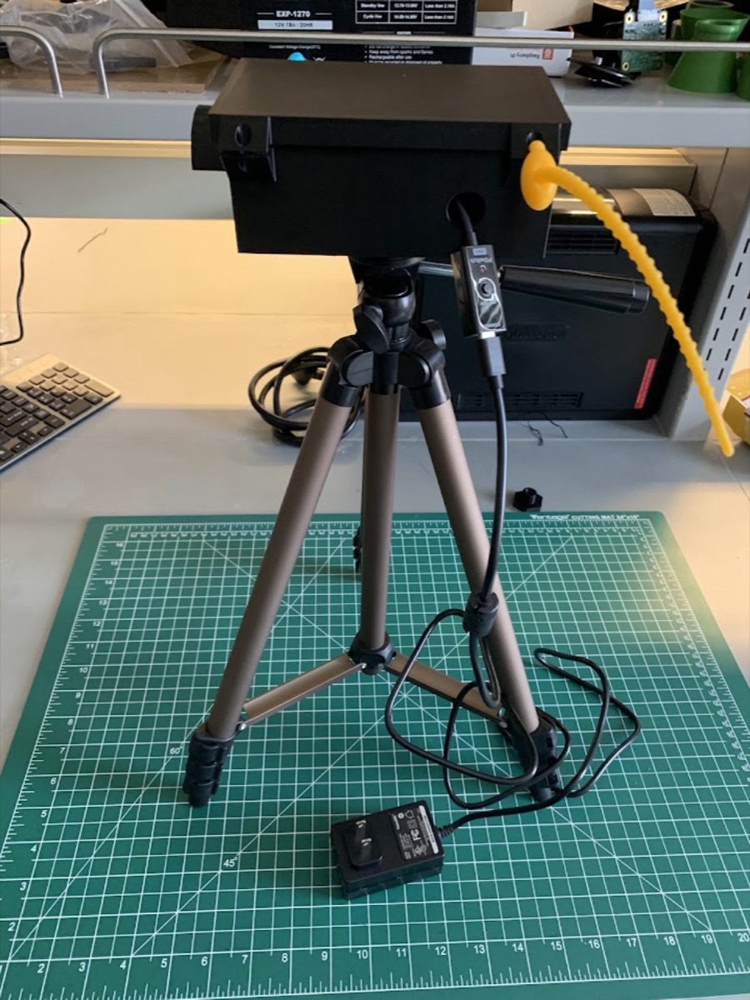{ width="420" }
</figure>

[Download the assembly manual (PDF)](../assets/BeeMonitor-Assembly-Manual.pdf){ .md-button }

!!! warning "Before you begin"
    Check every part against the list below.

## Parts & accessories

The numbers match the labels in the photo. Parts 12–14 are optional: you only need them to run the unit
from a battery or solar panel.

<figure markdown>
  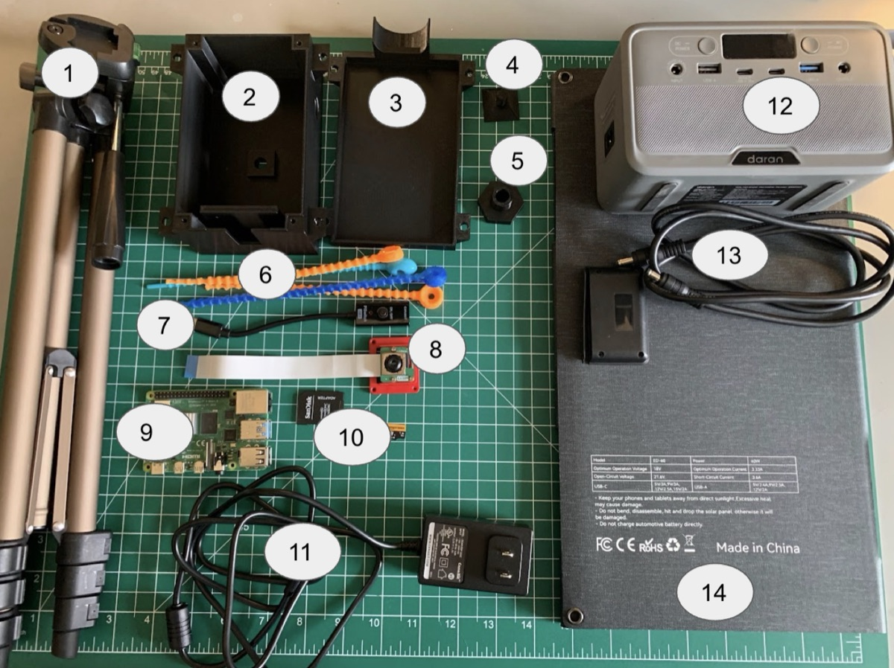
  <figcaption>Fig. 1 · Kit contents</figcaption>
</figure>

| No. | Part | Type |
|---|---|---|
| 1 | Tripod | Purchased |
| 2 | Case base | 3D printed |
| 3 | Case lid | 3D printed |
| 4 | Tripod connector | 3D printed |
| 5 | Power connector | 3D printed |
| 6 | Case cable ties | Purchased |
| 7 | Power button | Comes with the Pi kit |
| 8 | Camera (Arducam 64 MP) | Purchased |
| 9 | Raspberry Pi 4 | Purchased |
| 10 | microSD card | Purchased |
| 11 | Power cable | Comes with the Pi kit |
| 12 | Battery *(optional)* | Purchased |
| 13 | Solar cable *(optional)* | Purchased |
| 14 | Solar panel *(optional)* | Comes with the solar kit |

## Sourcing & cost

Prices are in US dollars at the time of writing and will vary by supplier and region.

| No. | Part | Required | Source | Price |
|---|---|---|---|---:|
| 01 | Tripod | Yes | [amazon.com/dp/B00XI87KV8](https://www.amazon.com/dp/B00XI87KV8) | 20.00 |
| 02 | Case base | Yes | 3D printed | 2.50 |
| 03 | Case lid | Yes | 3D printed | 1.50 |
| 04 | Tripod connector | Yes | 3D printed | 0.50 |
| 05 | Power connector | Yes | 3D printed | 0.50 |
| 06 | Case cable ties | Yes | [amazon.com/dp/B0DNF7WDSW](https://www.amazon.com/dp/B0DNF7WDSW) | 2.00 |
| 07 | Power button | Yes | Included with the Pi kit | incl. |
| 08 | Camera (Arducam 64 MP) | Yes | [amazon.com/dp/B0D3XHZ9S8](https://www.amazon.com/dp/B0D3XHZ9S8) | 57.00 |
| 09 | Raspberry Pi 4 | Yes | [amazon.com/dp/B07TXKY4Z9](https://www.amazon.com/dp/B07TXKY4Z9) | 125.00 |
| 10 | microSD card | Yes | [amazon.com/dp/B0B7NV73PJ](https://www.amazon.com/dp/B0B7NV73PJ) | 48.00 |
| 11 | Power cable | Yes | Included with the Pi kit | incl. |
| 12 | Battery | Optional | [amazon.com/dp/B0CQT5G1ZR](https://www.amazon.com/dp/B0CQT5G1ZR) | 80.00 |
| 13 | Solar cable | Optional | [amazon.com/dp/B0GLH13JK5](https://www.amazon.com/dp/B0GLH13JK5) | 56.00 |
| 14 | Solar panel | Optional | Included with the solar kit | incl. |

- **Core build · $257.00**

    Mains-powered unit, parts 1–11.

- **Full field build · $393.00**

    Adds battery and solar power, parts 12–14.

The 3D-printable case files (base, lid, tripod and power connectors) are in
[`hardware/enclosure`](https://github.com/eai6/BeeMonitor/tree/main/hardware/enclosure).

## Assembly

### Step 1 · Connect the camera

*Uses parts 8, 9.* Insert the camera ribbon into the camera slot of the Raspberry Pi 4.

<figure markdown>
  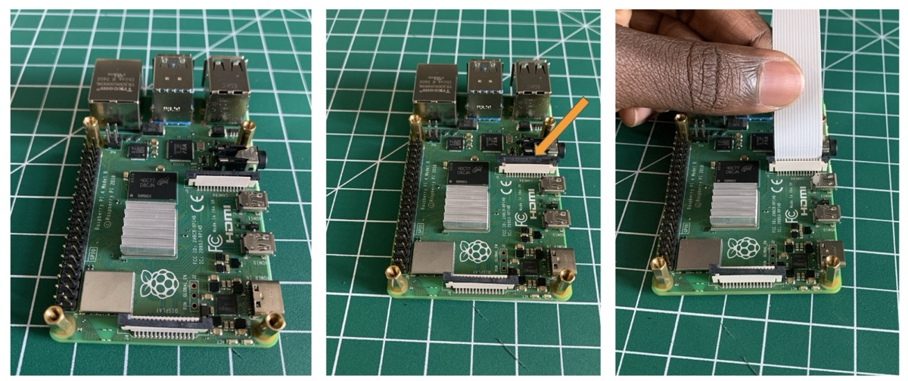
  <figcaption>Fig. 2 · a, b, c</figcaption>
</figure>

1. **a** · Lay the Raspberry Pi 4 face up.
2. **b** · Find the camera slot (arrowed) and gently lift its plastic latch.
3. **c** · Push the ribbon fully into the slot, then press the latch down to lock it.

<figure markdown>
  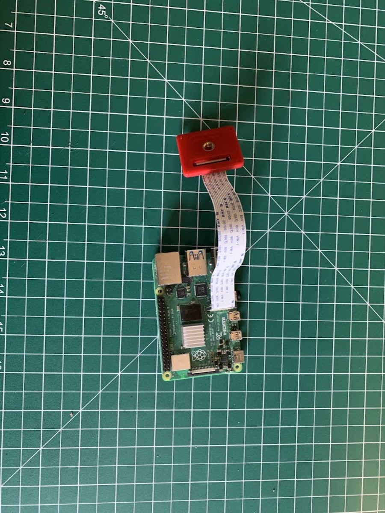{ width="320" }
  <figcaption>Fig. 3 · Connected</figcaption>
</figure>

!!! tip
    Hold the ribbon by its edges and avoid sharp folds.

### Step 2 · Seat in the case base

*Uses parts 2, 8, 9.* Slide the camera and Raspberry Pi into the case base.

<figure markdown>
  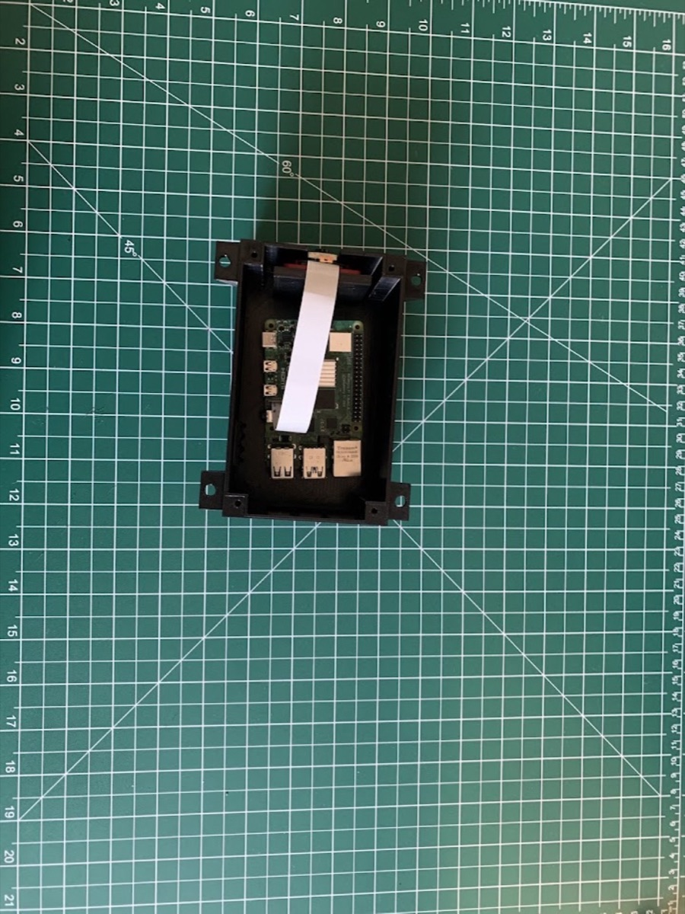{ width="320" }
  <figcaption>Fig. 4</figcaption>
</figure>

!!! tip
    Keep the ribbon flat so it isn't pinched when the lid goes on.

### Step 3 · Insert the SD card

*Uses part 10.* Insert a BeeMonitor-flashed and activated microSD card into the Raspberry Pi 4.

!!! warning "Before this step"
    Flash and activate the card by following the **Add a device** page on the platform:
    [beemonitor.edwardamoah.com/devices/enrollment](https://beemonitor.edwardamoah.com/devices/enrollment).

<figure markdown>
  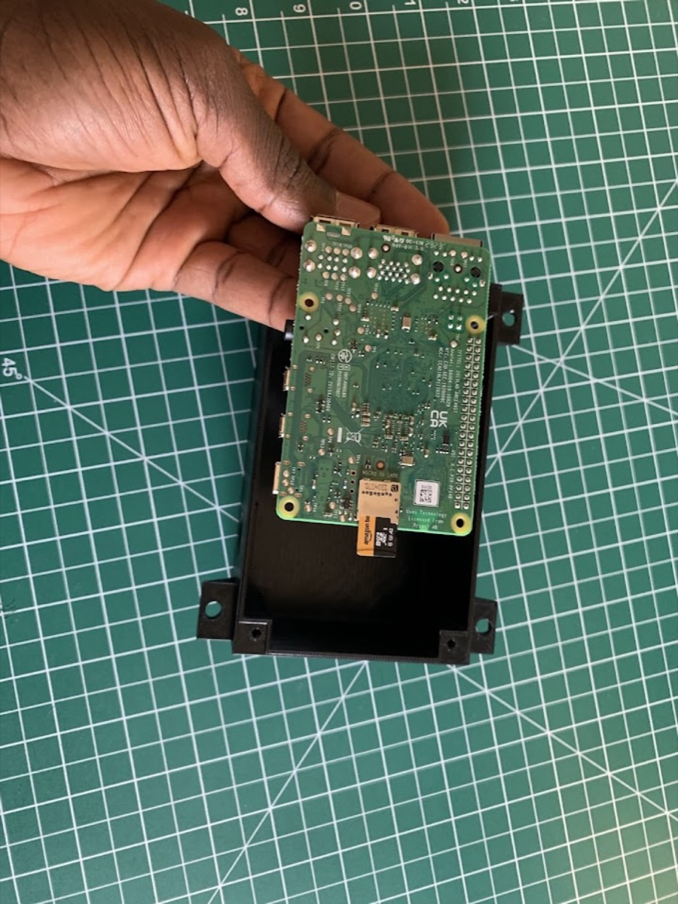{ width="320" }
  <figcaption>Fig. 5</figcaption>
</figure>

### Step 4 · Fit the power button

*Uses part 7.* Insert the power button through the side of the case.

<figure markdown>
  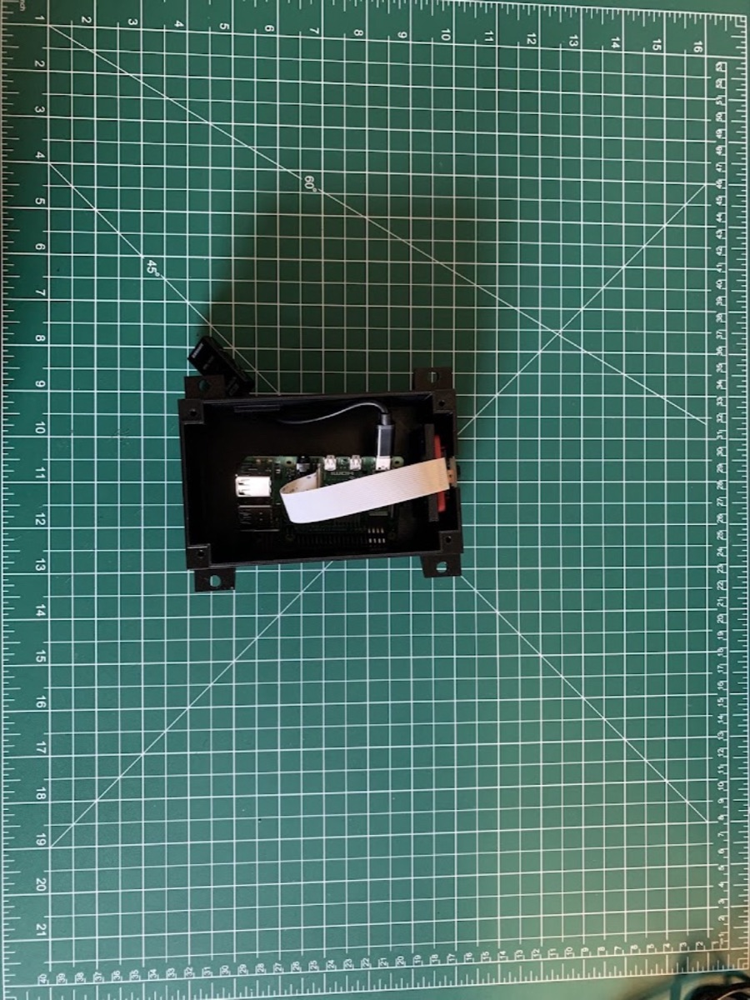{ width="320" }
  <figcaption>Fig. 6</figcaption>
</figure>

!!! tip
    Fit the Pi into the case with the cable side facing up.

### Step 5 · Close the case

*Uses part 3.* Cover the case base with the lid.

<figure markdown>
  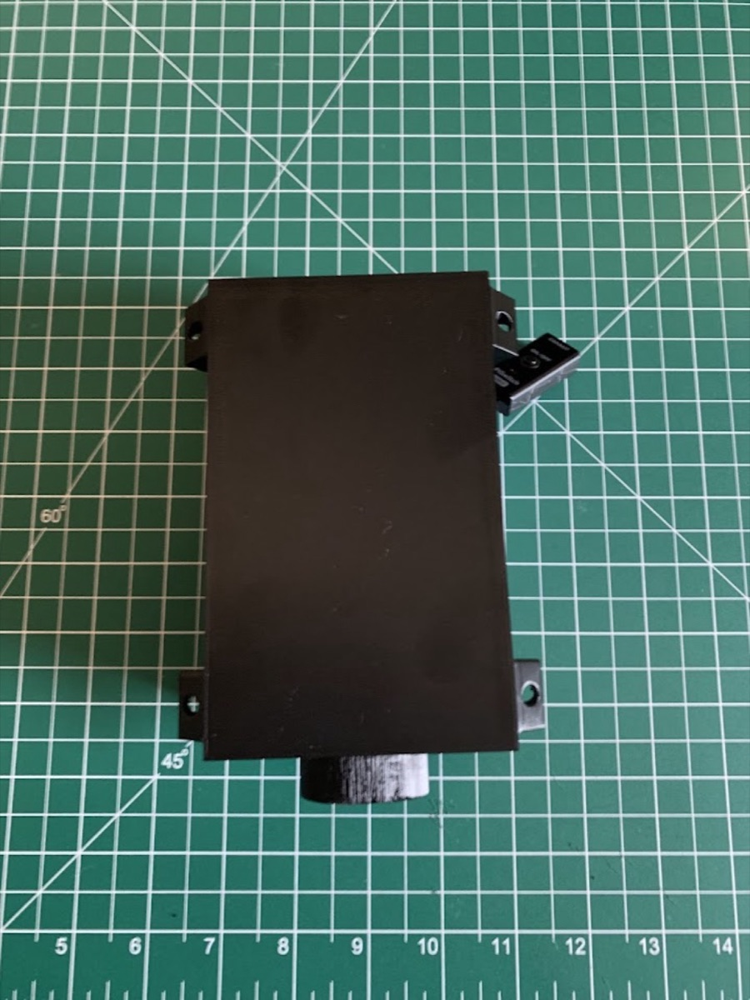{ width="320" }
  <figcaption>Fig. 7</figcaption>
</figure>

!!! tip
    Check that no cable is caught under the edge of the lid.

### Step 6 · Add the tripod connector

*Uses part 4.* Screw the tripod connector into the base of the case.

<figure markdown>
  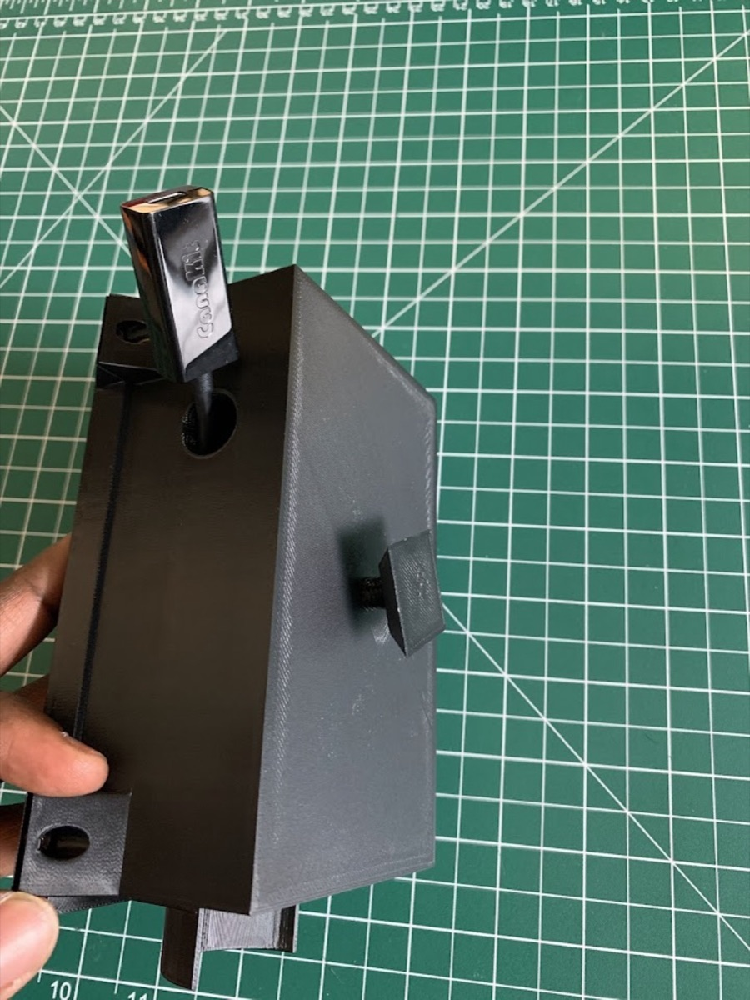{ width="320" }
  <figcaption>Fig. 8</figcaption>
</figure>

!!! tip
    Hand-tighten only. Printed threads can strip if forced.

### Step 7 · Secure the lid

*Uses part 6.* Fasten the lid to the case base with the cable ties.

<figure markdown>
  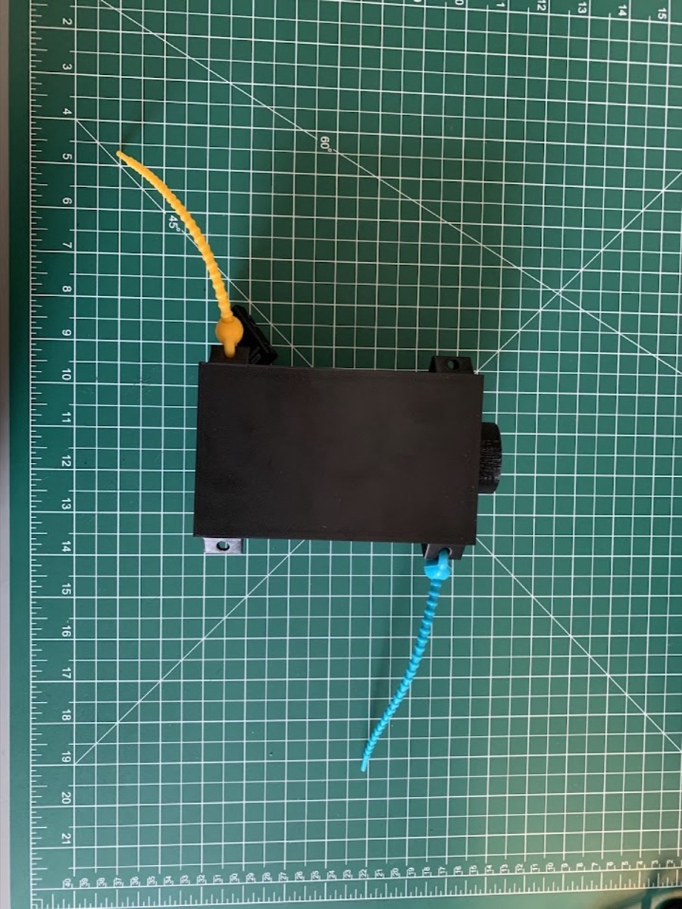{ width="320" }
  <figcaption>Fig. 9</figcaption>
</figure>

!!! tip
    The silicone ties are reusable, so the case can be reopened later.

### Step 8 · Mount on the tripod

*Uses parts 1, 4.* Attach the case to the tripod head using the tripod connector at the base of the case.

<figure markdown>
  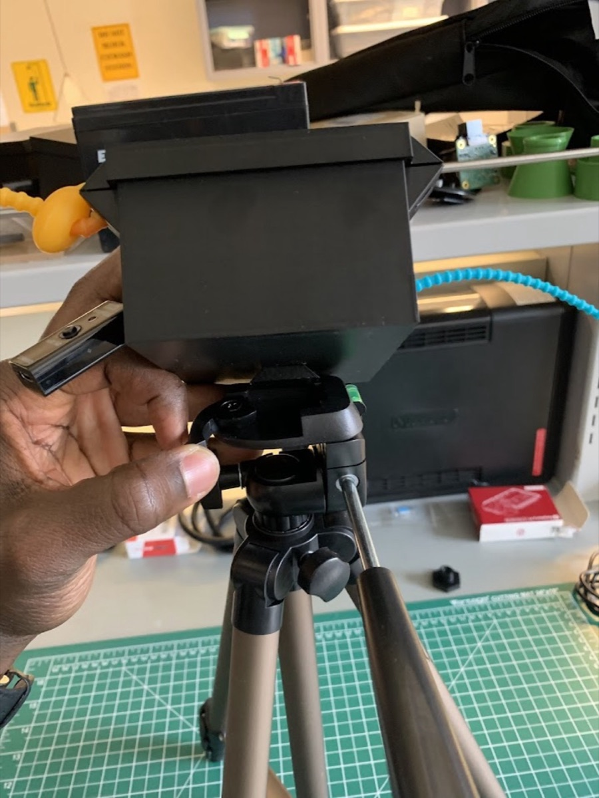{ width="320" }
  <figcaption>Fig. 10</figcaption>
</figure>

!!! tip
    Lock the tripod legs before letting go of the case.

### Step 9 · Connect the power cable

*Uses part 11.* Plug the power cable into the BeeMonitor.

<figure markdown>
  { width="320" }
  <figcaption>Fig. 11</figcaption>
</figure>

!!! tip
    Leave some slack so the camera can be re-aimed without pulling the cable.

## Step 10 · Power the BeeMonitor

Run the unit from a wall socket, or from a battery in the field. Add the solar panel to keep the battery
charged. Choose one:

=== "A · Wall socket"

    *Part 11.* Plug the power cable into a power socket. Best for lab use or a site with mains power.

    <figure markdown>
      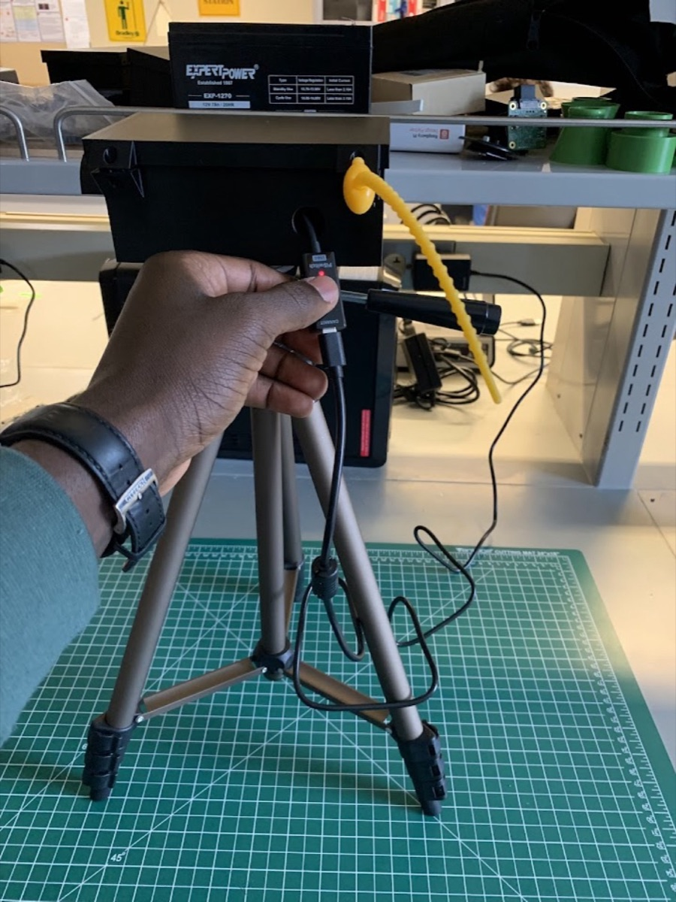{ width="320" }
      <figcaption>Fig. 12</figcaption>
    </figure>

=== "B · Battery"

    *Parts 11, 12 · optional.* Plug the same power cable into the battery's AC outlet instead of a wall
    socket. Use this in the field.

    <figure markdown>
      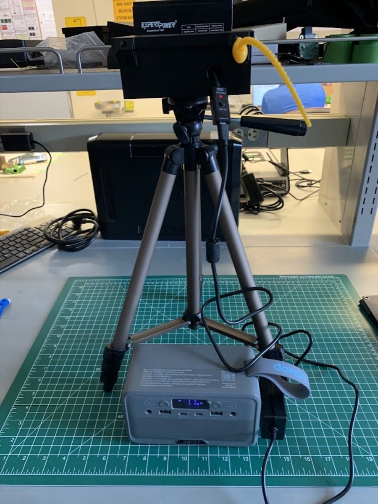{ width="320" }
      <figcaption>Fig. 13</figcaption>
    </figure>

=== "C · Battery + solar"

    *Parts 12–14 · optional.* Set up option B, then connect the solar panel to the battery with the solar
    cable.

    <figure markdown>
      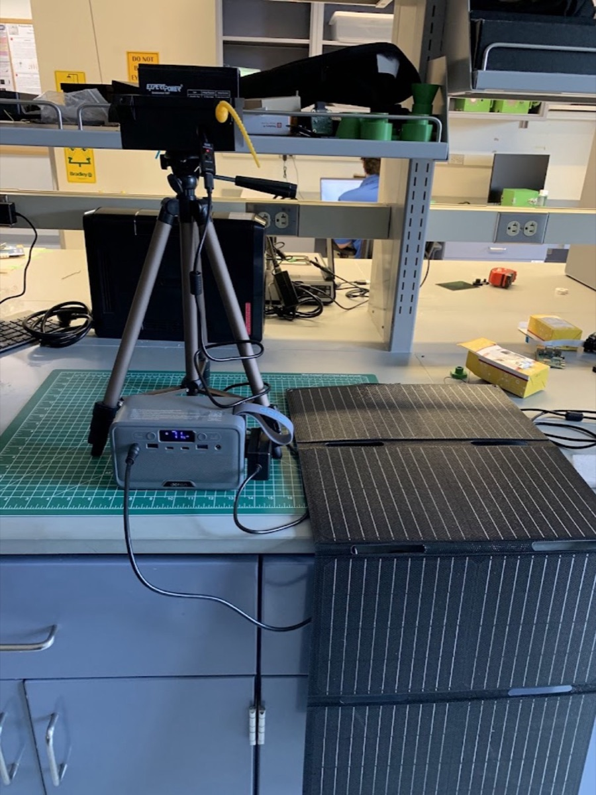{ width="320" }
      <figcaption>Fig. 14</figcaption>
    </figure>

!!! success "Switch on"
    With power connected, press the power button on the side of the case to start the BeeMonitor.

## Assembly complete

Point the camera at your study site, whether a bee hotel, a flower patch or a nesting area, then start
recording from the BeeMonitor platform.

- **Platform**

    Add devices, flash SD cards and view recordings at
    [beemonitor.edwardamoah.com](https://beemonitor.edwardamoah.com). See [Devices](../platform/devices.md).

- **Print files**

    Case base, lid and connectors for 3D printing:
    [hardware/enclosure](https://github.com/eai6/BeeMonitor/tree/main/hardware/enclosure).

- **Support**

    Missing a part or stuck on a step? Email [eai6@psu.edu](mailto:eai6@psu.edu) or open an
    [issue on GitHub](https://github.com/eai6/BeeMonitor/issues).

