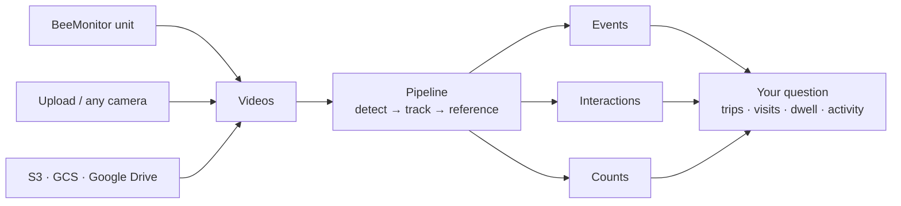

# BeeMonitor

**Open-source hardware and an open-source analysis platform for studying pollinator behaviour from video.**

BeeMonitor started as a camera trap for bee hotels. It is now a general system: any video of insects,
whether from a BeeMonitor unit, another camera or your cloud storage, goes through the same pipeline and comes
out as two tables, **events** and **interactions**.

## Two tables, any question

Every pipeline produces the same two tables:

- **Events**: something entered or exited something. *A bee left tube 3 at 12.4 s.*
- **Interactions**: two things were together for a while. *A bee was on the flower from 3.0 s to 9.5 s.*

You then derive what your study needs from them: foraging trips at a nest hotel from events; visits and time
on a flower, or time in each zone of an indoor pollen assay, from interactions; encounters between insects
from interactions between two tracks. See [Events & interactions](concepts/results.md).

## How it works

1. **Get video in.** Build a [BeeMonitor unit](hardware/index.md) that records when something moves, or
   [upload clips](platform/sources.md) from any camera.
2. **Run a pipeline.** Pick a template or build your own: detect the insects, track them, and measure them
   against a *reference* (a nest tube, a flower, a region you draw). See [Concepts](concepts/index.md).
3. **Read the results.** Every pipeline writes the same [events and interactions tables](concepts/results.md),
   which you can open in a spreadsheet, R or Python.
4. **Improve the models.** [Label your own frames](platform/annotation.md), train a detector for your
   species, and [publish](platform/sharing.md) the dataset for others.

## Open source

The device software, the 3D-printed enclosure, the web platform, the GPU analysis code and these docs are
all on [GitHub](https://github.com/eai6/BeeMonitor) under AGPLv3. See [what's in the repository](open-source/index.md).

## Where to start

- **[Understand the model](concepts/index.md)**: sources, pipelines, events and interactions.
- **[Build a unit](hardware/index.md)**: parts, enclosure, assembly and field deployment.
- **[Use the platform](platform/devices.md)**: devices, uploads, pipelines, annotation.
- **[Cite BeeMonitor](about/license.md)**

## Accuracy

Validated on bee hotels: 110 minutes of video with 300 hand-annotated foraging events.

| Mode | Precision | Recall | F1 |
|---|---|---|---|
| Full tracking | 93.9% | 87.7% | 0.907 |
| Two-mode adaptive | 92.0% | 84.3% | 0.880 |

## Acknowledgements

NSF Research Traineeship Program (INSECT NET, Grant 2243979) · USDA NIFA Hatch and Smith-Lever
Appropriations (PEN04943, PEN08801) · Penn State Joan Luerssen Faculty Enhancement Fund.
