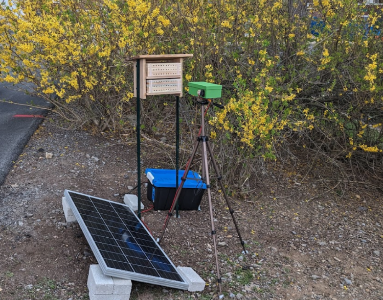

# BeeMonitor

**Open-source hardware and an open-source analysis platform for studying pollinator behaviour from video.**

BeeMonitor started as a camera trap for bee hotels. It is now a general system: video of insects from a
BeeMonitor unit or any other camera, analysed with computer-vision pipelines you build from blocks —
detect, track, identify species and individuals, and measure behaviour.

!!! abstract "Preprint"
    The BeeMonitor system and its validation are described in our preprint on
    [bioRxiv](https://www.biorxiv.org/content/10.64898/2026.07.10.737879v1).

## Pipelines from blocks

Connect the blocks your question needs: count insects with **Detect** alone; add **Track** and **Identify**
to name the species of every insect that passes; add a **Reference** (nest tubes, a flower, an arena zone)
and **Analyze** to measure behaviour against it. See [Get started](get-started.md#2-build-a-pipeline).

Behaviour comes out as two tables:

- **Events**: something entered or exited something. *A bee left tube 3 at 12.4 s.*
- **Interactions**: two things were together for a while. *A bee was on the flower from 3.0 s to 9.5 s.*

Foraging trips come from events; visits and time on a flower, which pollen tube in a lab assay gets more
(and longer) bee interactions, and encounters between insects come from interactions. See
[Results](platform/results.md).

## Start here

- **[Get started](get-started.md)**: get video in, run a pipeline, read the results.
- **[Build a unit](hardware/index.md)**: parts, costs and ten assembly steps, with a printable manual.
- **[Use the platform](platform/index.md)**: devices, videos, pipelines, annotation, API.

Everything (the hardware, device software, platform, analysis code and these docs) is open source under
AGPLv3 on [GitHub](https://github.com/eai6/BeeMonitor). See [About](about.md) to cite it or contribute.

## Accuracy

Validated on bee hotels: 110 minutes of video with 300 hand-annotated foraging events
([preprint](https://www.biorxiv.org/content/10.64898/2026.07.10.737879v1)).

| Mode | Precision | Recall | F1 |
|---|---|---|---|
| Full tracking | 93.9% | 87.7% | 0.907 |
| Two-mode adaptive | 92.0% | 84.3% | 0.880 |

## Acknowledgements

NSF Research Traineeship Program (INSECT NET, Grant 2243979) · USDA NIFA Hatch and Smith-Lever
Appropriations (PEN04943, PEN08801) · Penn State Joan Luerssen Faculty Enhancement Fund.
