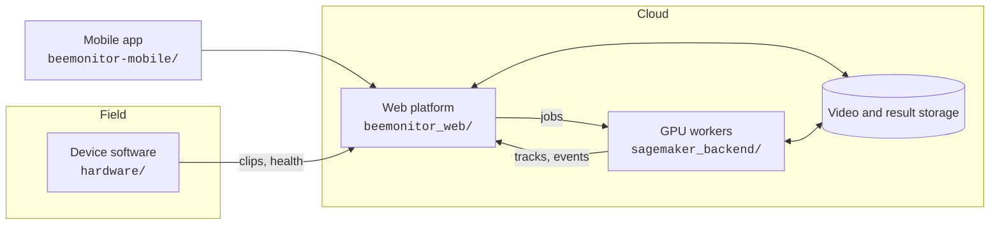

# What's in the repository

Everything is in one repository, [github.com/eai6/BeeMonitor](https://github.com/eai6/BeeMonitor), under
[AGPLv3](../about/license.md): the hardware, the device software, the analysis code, the web platform and
these docs.

## Components

| Folder | What it is | Built with |
|---|---|---|
| `hardware/` | Device software: motion-gated recording, uploader, health telemetry, enrolment, updates, cellular; BOM and enclosure STLs in `hardware/enclosure/` | Python, picamera2 / DepthAI, systemd |
| `src/beemonitor/` | The core analysis engine: detection, BeeTrack tracking, event classification, outputs. Usable on its own as a Python package | Python, Ultralytics YOLO, OpenCV |
| `beemonitor_web/` | The platform: devices, Processing, the pipeline builder and engine, annotation, training, publishing, the API | Django, PostgreSQL, Tailwind |
| `sagemaker_backend/` | GPU workers: detection + tracking, SAM 3 sampling and labelling, BeeMachine species ID, model training | Docker, PyTorch, AWS SageMaker |
| `cloud/` | Storage and ingestion connectors (S3, GCS, Google Drive) | Python |
| `models/` | Model weights: bee detector, nest detector, entry/exit classifier | |
| `beemonitor-mobile/` | Mobile app for checking devices, videos and jobs | Expo / React Native |
| `desktop/` | Offline desktop app for analysing hotel videos on your own computer, no cloud needed | PyQt6 |
| `infra/` | Cloud infrastructure as code | Pulumi (AWS) |
| `docs/` | This site | MkDocs Material |

## Running parts of it yourself

- **Analyse videos offline**: the [desktop app](https://github.com/eai6/BeeMonitor/tree/main/desktop) or the
  `beemonitor` Python package runs detection, tracking and entry/exit events on your own machine (a GPU helps).
- **Use the hosted platform**: [beemonitor.edwardamoah.com](https://beemonitor.edwardamoah.com). Units,
  pipelines, annotation and training all run there.
- **Self-host the platform**: the code and the infrastructure definitions are all in the repository, but a
  step-by-step self-hosting guide isn't written yet. Open an
  [issue](https://github.com/eai6/BeeMonitor/issues) if you plan to do this.

**Next:** [Contributing](contributing.md)
