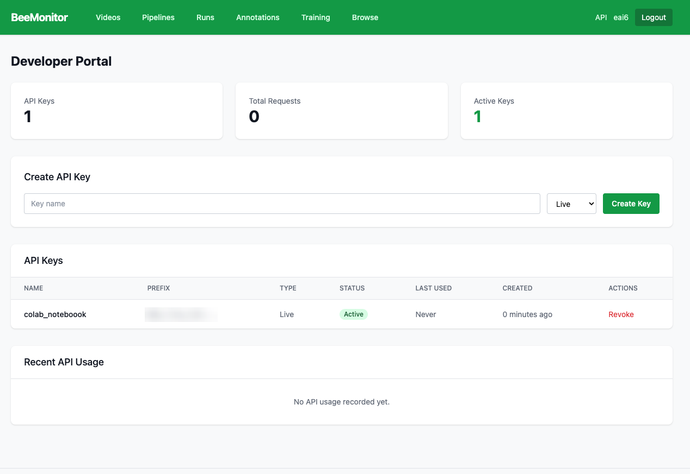

# API

Everything the pipeline builder does is also available over a REST API, so you can upload clips, run
pipelines and fetch results from Python, R or a Colab notebook.

## Get a key

Click **API** in the top bar (next to your username) and **Create API Key**. The key starts with `bmk_` and is shown only once. Send it with every request:

```
Authorization: Bearer <your key>
```

Base URL: `https://beemonitor.edwardamoah.com/api/v1/`

<figure markdown>
  
  <figcaption>The API page. Revoke a key here when you no longer need it.</figcaption>
</figure>

## Endpoints

| Method | Path | Does |
|---|---|---|
| GET | `pipelines/blocks/` | Every step type, with its inputs, outputs and settings |
| GET / POST | `pipelines/` | List your pipelines and the templates, or create one `{title, steps}` |
| GET / PUT / DELETE | `pipelines/{id}/` | Read, change or delete a pipeline |
| POST | `pipelines/validate/` | Check a `steps` graph without saving it |
| POST | `pipelines/{id}/clone/` | Copy a template into your pipelines |
| POST | `pipelines/{id}/run/` | Run it on `{video_ids: [...]}`, with one run per video |
| GET | `pipeline-runs/` | Your recent runs |
| GET | `pipeline-runs/{id}/` | Status and each step's output |
| GET | `pipeline-runs/{id}/steps/{step}/output/?format=csv` | One step's table as CSV |
| POST | `pipelines/uploads/initiate` | Get a signed upload URL `{filename, size_bytes}` |
| POST | `pipelines/uploads/complete` | Register the uploaded clip `{storage_key, file_size_bytes, site_name?}` |

## Example

```python
import io, os, time, requests, pandas as pd

API = "https://beemonitor.edwardamoah.com/api/v1/"
H = {"Authorization": f"Bearer {os.environ['BEEMONITOR_API_KEY']}"}

# 1. Upload a clip
path = "clip.mp4"
size = os.path.getsize(path)
up = requests.post(API + "pipelines/uploads/initiate", headers=H,
                   json={"filename": "clip.mp4", "size_bytes": size}).json()
with open(path, "rb") as f:
    requests.put(up["upload_url"], data=f, headers=up["headers"]).raise_for_status()
video = requests.post(API + "pipelines/uploads/complete", headers=H,
                      json={"storage_key": up["storage_key"], "file_size_bytes": size,
                            "site_name": "Garden"}).json()

# 2. Run a template on it
pipes = requests.get(API + "pipelines/", headers=H).json()
# ... pick the pipeline id of "Flower / ROI visitation" from `pipes`
run = requests.post(API + f"pipelines/{pipeline_id}/run/", headers=H,
                    json={"video_ids": [video["video_id"]]}).json()["runs"][0]

# 3. Wait, then fetch a step's table
while True:
    r = requests.get(API + f"pipeline-runs/{run['run_id']}/", headers=H).json()
    if r["status"] in ("completed", "failed"):
        break
    time.sleep(30)
csv = requests.get(API + f"pipeline-runs/{run['run_id']}/steps/g/output/",
                   headers=H, params={"format": "csv"}).text
df = pd.read_csv(io.StringIO(csv))
```

GPU runs use your account's credits, as they do in the web app.
