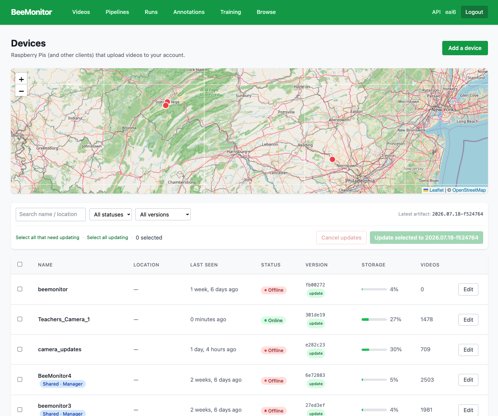
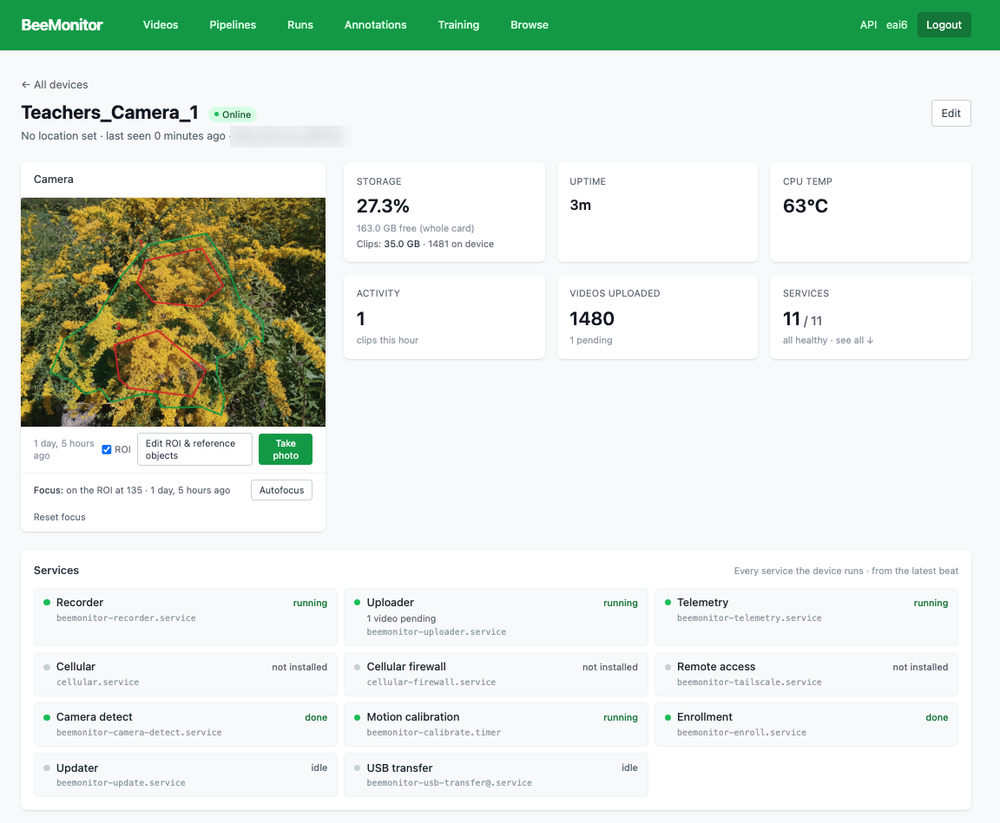
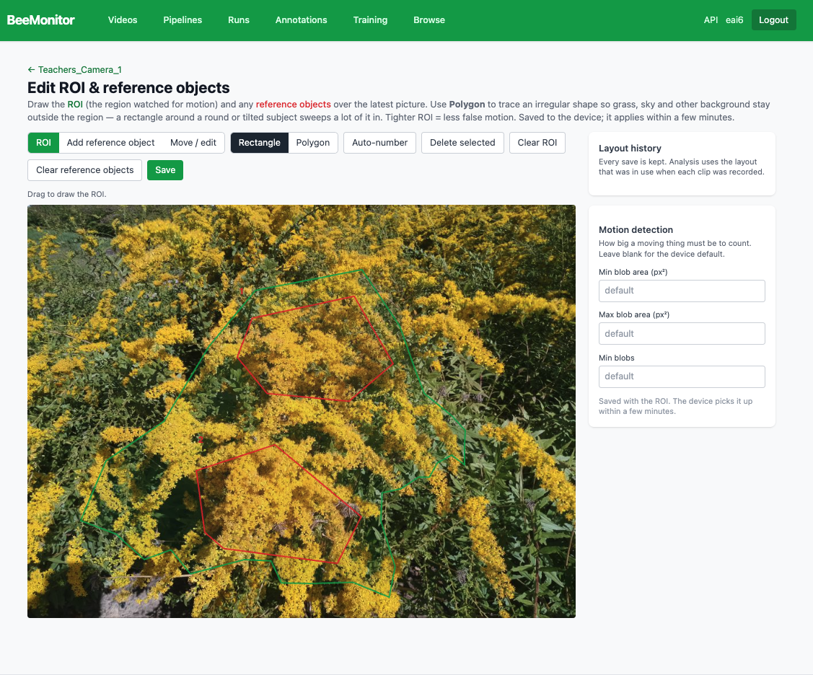
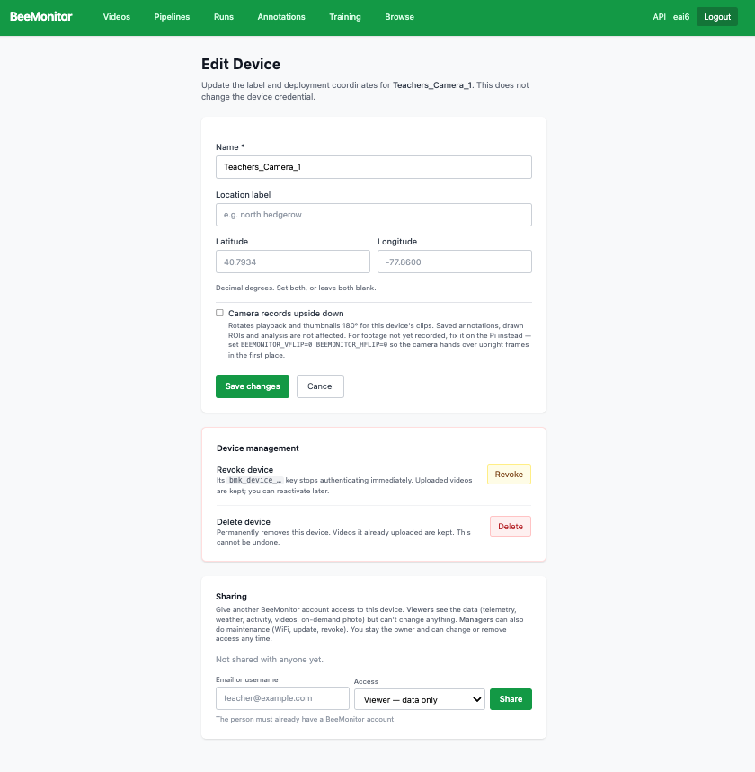

# Devices

**Devices** (the BeeMonitor logo) lists your units on a map and in a table: when each was last seen, whether
it's online, its software version, how full its card is and how many videos it has uploaded. Units that need
a software update can be updated from here, together or one at a time.

<figure markdown>
  
  <figcaption>Devices: every unit, with its status, version and storage.</figcaption>
</figure>

Click a unit to open its device page: the latest picture with its ROI, storage, uptime, temperature, activity
and uploads, and the state of every service the unit runs.

<figure markdown>
  
  <figcaption>A device page.</figcaption>
</figure>

## Camera

- **Take photo** — a picture from the camera now.
- **Edit ROI & reference objects** — draw the ROI (the region watched for motion) and the reference
  objects analysis measures against: nest tubes, flowers, pollen tubes. Use **Rectangle**, or **Polygon**
  to keep grass and sky out of an irregular region. Motion only counts inside the ROI, and the **Motion
  detection** panel sets how big a moving thing must be. Each change is kept as a new version, so older
  clips are analysed with the layout they were recorded with.
- **Autofocus** — focuses on the ROI (or the hotel it detected, or the centre) between clips and keeps
  that focus. **Reset focus** forgets it.

<figure markdown>
  
  <figcaption>Edit ROI & reference objects: a polygon ROI (green) around two flower patches drawn as reference objects (red).</figcaption>
</figure>

## Recording

- **Mode** — *Motion-triggered* (default): a clip starts when something moves in the ROI and ends 5 s
  after it stops. *Continuous*: records the whole window in 10-minute clips. *Off*.
- **Hours** — the window the unit may record in, in the device's local time.
- **Full-resolution photos** (64 MP OwlSight or OAK cameras):
    - **On motion: 5 photos, then video** — five photos at every trigger, then the clip. They show on that
      clip's page.
    - **Also periodically** — a photo every 15, 30 or 60 minutes. They show under **Photos** in Videos.
    - **Take one now**.

<figure markdown>
  
  <figcaption>Recording on a device page: the mode and hours, then full-resolution photos.</figcaption>
</figure>

## Health

Storage, temperature, battery, connection and uploads, with a history chart under **Advanced settings**.

## Storage

Clips and photos stay on the card after uploading. **Free space on the device** deletes the card's
copies of everything already uploaded; the cloud copies are kept.

## Sharing

On the device page, **Edit → Sharing**: enter someone's username or email and choose their access. They need
a BeeMonitor account. You stay the owner and can change or remove access at any time.

| Access | Can |
|---|---|
| Viewer | See the data: telemetry, weather, activity, videos, photos on demand. Can't change anything |
| Manager | Also do maintenance: Wi-Fi, software updates, revoking the device |

<figure markdown>
  
  <figcaption>Edit device: its name and location, revoke or delete, and sharing.</figcaption>
</figure>

