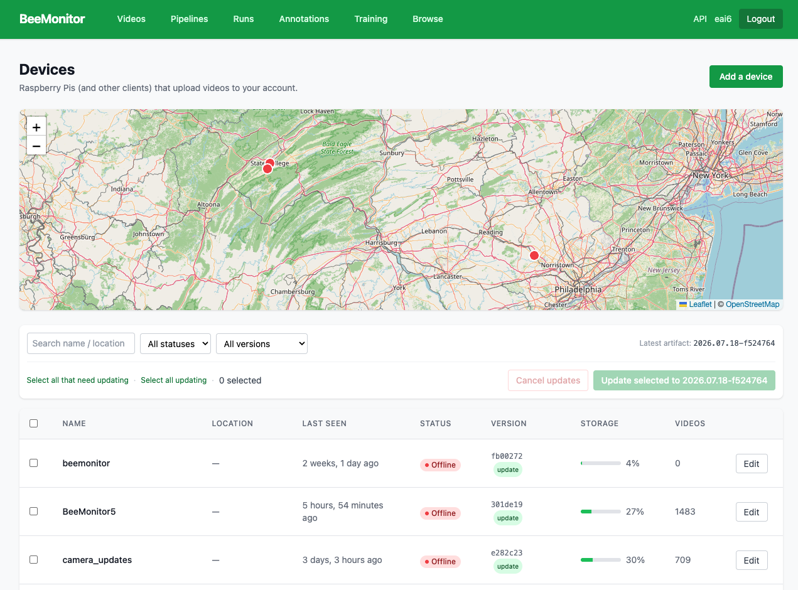

# Use the platform

Everything happens at [beemonitor.edwardamoah.com](https://beemonitor.edwardamoah.com). These pages follow
the menu bar, left to right.

<figure markdown>
  
  <figcaption>The menu bar. <b>BeeMonitor</b> (your home page, Devices), then Videos, Pipelines, Runs,
  Annotations, Training and Browse; on the right, API and your name (Account). Each has a page below.</figcaption>
</figure>

- **[Devices](devices.md)**: the **BeeMonitor** logo, your home page. Each unit's camera, ROI and reference
  objects, recording settings, health, storage and sharing.
- **[Videos](videos.md)**: upload clips and photos, browse them, and run a pipeline on them.
- **[Pipelines](pipelines.md)**: build analyses from blocks, or start from a template.
- **[Runs](runs.md)**: every run and batch, and the tables they produce: tracks, events and interactions.
- **[Annotations](annotations.md)**: label frames with your team to teach a detector your insects.
- **[Training](training.md)**: train a model on a labelled project, or upload your own.
- **[Browse](browse.md)**: datasets and models other people have published.
- **[API](api.md)**: API keys, and uploading, running and fetching results from code.
- **[Account](account.md)**: your name in the menu bar. Credits, GPU usage and password.

