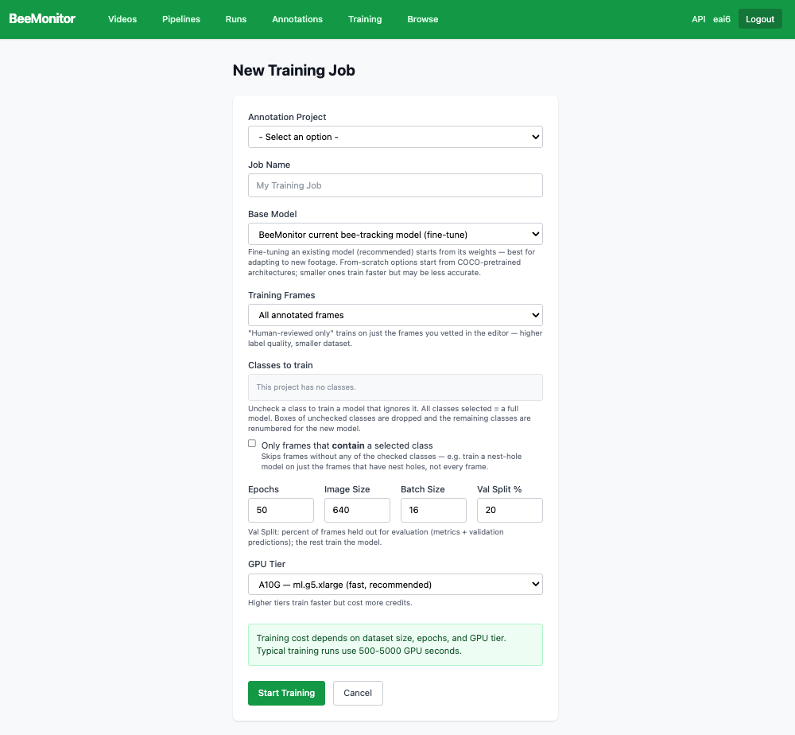
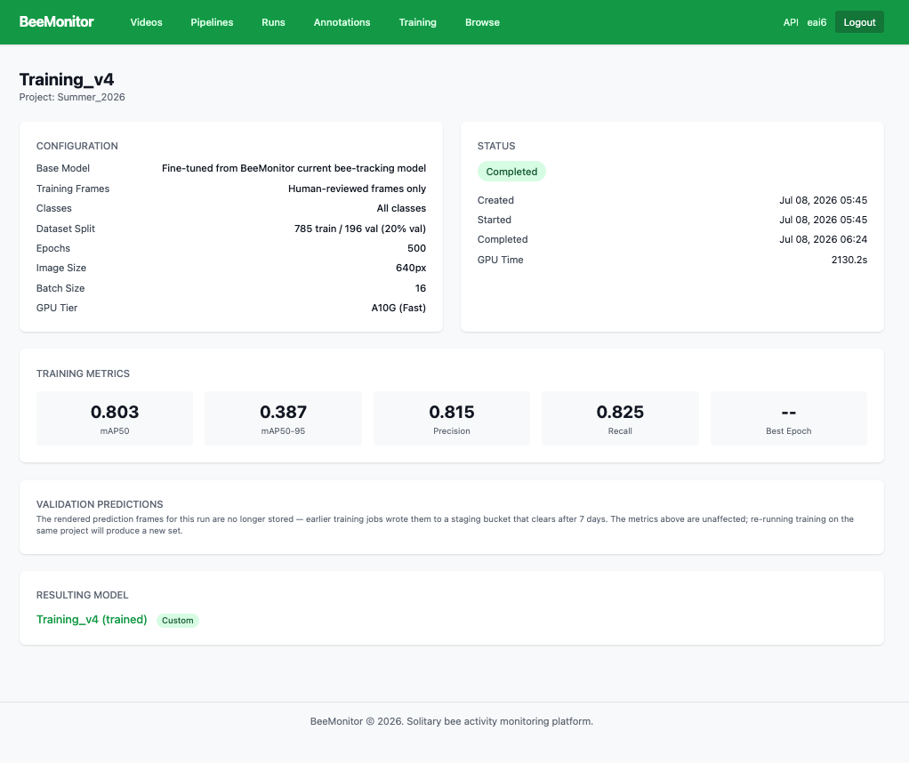

# Training

Train a detector on one of your [annotation projects](annotations.md), or upload one you trained elsewhere.
Your models then appear in a pipeline's **Detect** step.

## Train a model

**Training → New Training Job**:

| Setting | What it means |
|---|---|
| **Annotation project** | The labelled frames to learn from |
| **Classes to train** | All classes for a full model, or only some: boxes of unchecked classes are dropped |
| **Training frames** | All frames, or **Human-reviewed only**: just the frames you checked, so the labels are better but there are fewer of them. You can also skip frames that contain none of the chosen classes |
| **Base model** | Fine-tune an existing model (recommended, best for new footage), or train from scratch |
| **Val split** | The share of frames held back to measure the model |
| **GPU tier** | Higher tiers train faster and cost more credits |

Training typically takes 500 to 5,000 GPU seconds, depending on the number of frames, epochs and tier.

<figure markdown>
  
  <figcaption>New training job.</figcaption>
</figure>

## A training job

The job page shows its configuration and status, and, when it finishes:

- **Training metrics** on the held-back frames: mAP50, mAP50-95, precision and recall, and how they changed
  over the epochs;
- **Validation predictions**: the model's boxes on held-back frames, to check by eye;
- the **resulting model**, ready to choose in a pipeline.

<figure markdown>
  
  <figcaption>A finished training job.</figcaption>
</figure>

## Custom models

**Custom Models** lists every model you own. **Upload Model** adds a YOLO model you trained elsewhere
(`.pt` or `.onnx`). Choose what it detects, which decides where it is offered in a pipeline.

On a model's page, **Publish** makes it public: anyone can choose it in a pipeline, under [Browse](browse.md).
**Make private** undoes it.
