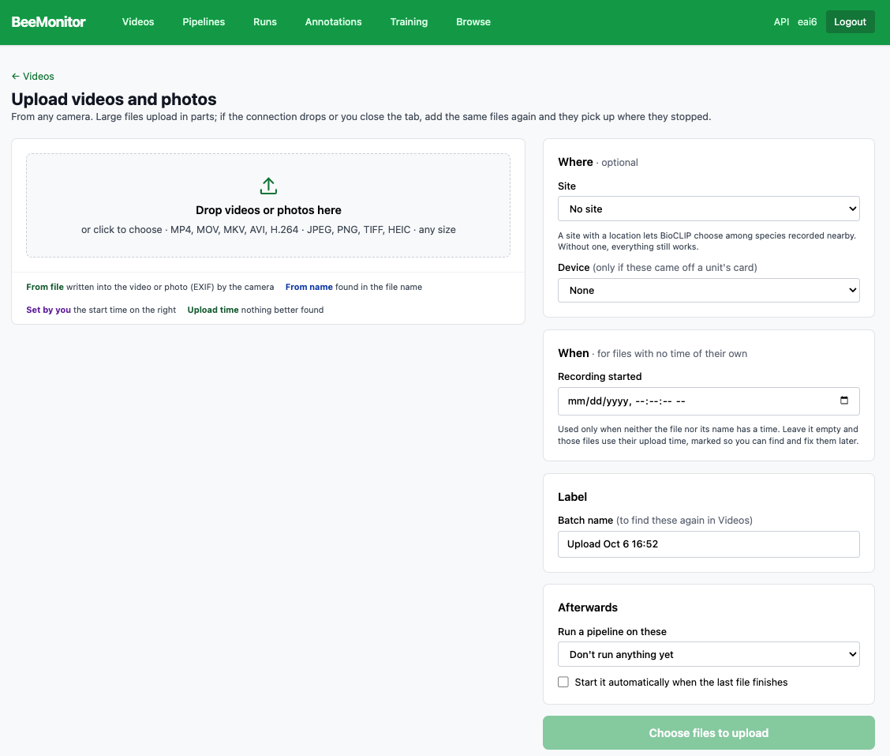
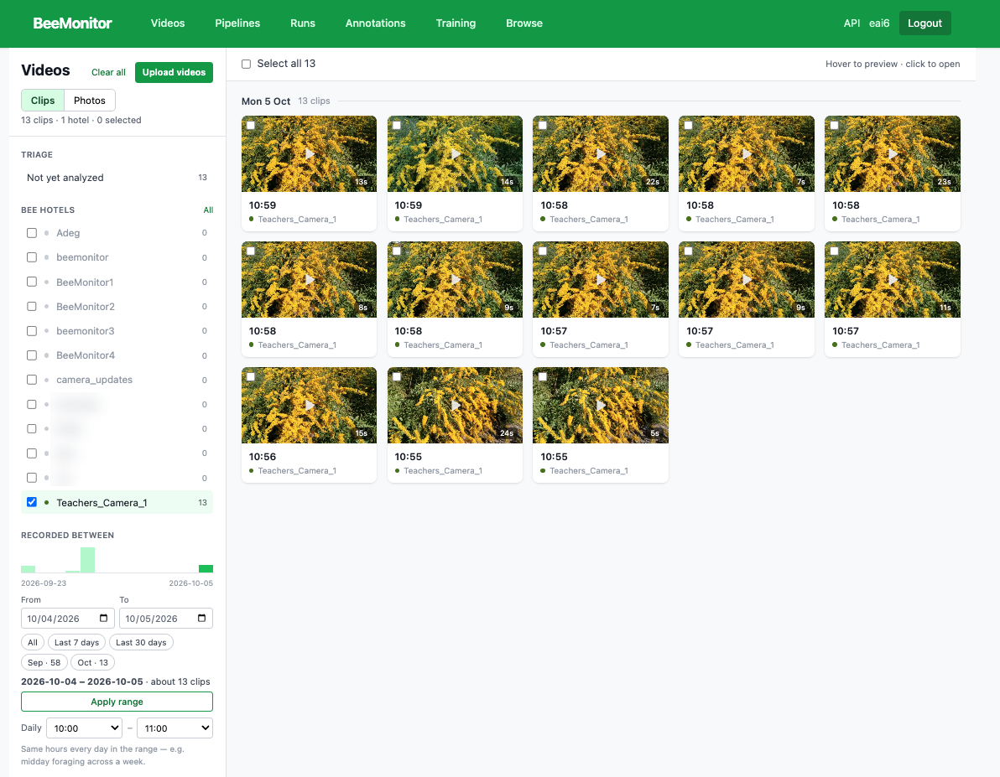
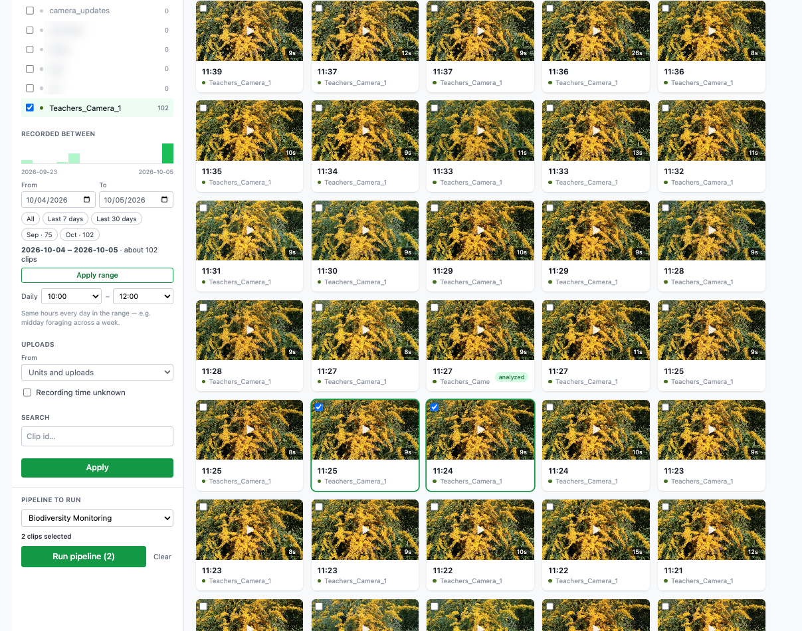
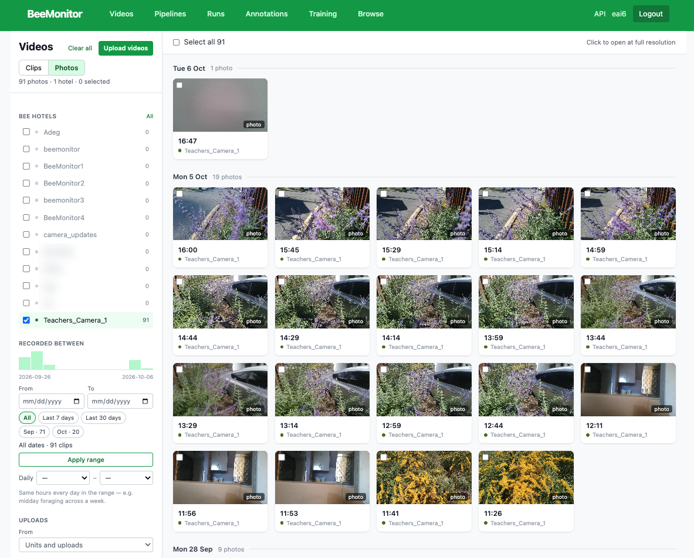
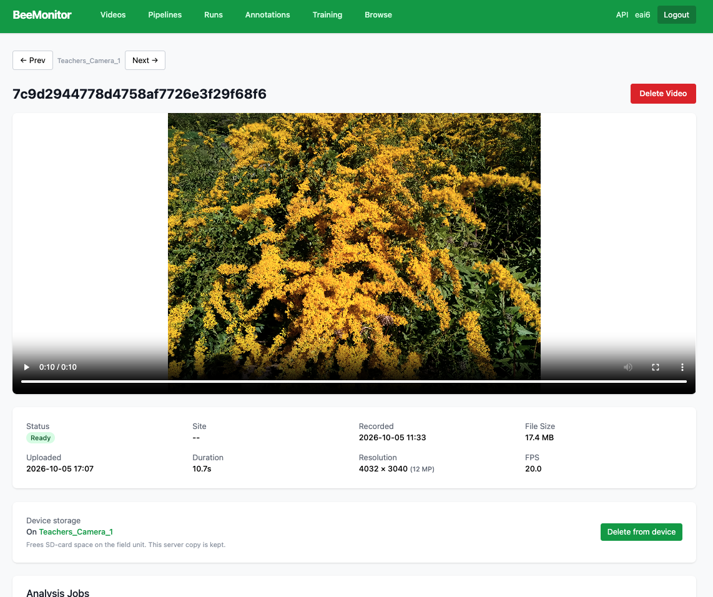

# Videos

## Getting video in

### From a BeeMonitor unit

An enrolled unit uploads its clips and photos by itself (see [Build a unit](../hardware/index.md)). They
appear under **Videos**, already linked to the device, its location and the layout it was recorded with.

### Upload from any camera

**Videos → Upload videos.** Drop in any number of videos (MP4, MOV, MKV, AVI, H.264) or photos (JPEG, PNG,
TIFF, HEIC), of any size. They go
straight from your browser to storage in parts: if the connection drops or you close the tab, add the same
files again and they pick up where they stopped.

- **When it was recorded.** Each file's time is taken from, in order: the file itself (MP4/MOV cameras write
  it; for photos, the EXIF capture time), a date-time in the file name (`2026-10-04_09_12_40`, `20261004_091240`, `IMG_20261004_091240`…), the
  start time you type for the batch, and finally the upload time. The page shows which one each file got;
  clips left on the upload time can be found later with the **Recording time unknown** filter.
- **Where (optional).** Pick a saved site, add a new one (a name, and a pin on the map if you want), or
  leave it empty. A site with a location gives BioCLIP its list of local species. If the clips came off a
  unit's card, choose that device instead.
- **Label.** A batch name to find these clips again (**Batch** filter in Videos).
- **Afterwards.** Choose a pipeline to run on the new clips — straight away when the last file lands, or
  with one click.
- Files you already uploaded (same name and size) are skipped unless you say otherwise. AVI files are
  converted to MP4 after upload so they play in the browser; analysis can use them right away.

<figure markdown>
  
  <figcaption>Upload videos and photos. The legend under the drop zone shows where each file's time came from.</figcaption>
</figure>

### From code

The [API](api.md) uploads clips and runs pipelines from a script or a notebook.

## Browsing videos and photos

**Videos** shows your clips by day. Filter them on the left by unit, by date range (the bar chart shows
how many clips each day has), by hours of the day across that range, by where they came from (units or
uploads), and by clip id.

<figure markdown>
  
  <figcaption>Videos: clips grouped by day, filtered to one unit and two days.</figcaption>
</figure>

- Hover a clip to preview it; click to open it.
- Select clips (or **Select all**), choose a pipeline under **Pipeline to run**, and **Run pipeline**
  ([Pipelines](pipelines.md)).

<figure markdown>
  
  <figcaption>Two clips selected and a pipeline chosen.</figcaption>
</figure>

Switch to **Photos** for photos: a unit's full-resolution photos and photos you uploaded. Run a pipeline on
them the same way, with a pipeline that starts from a **Photo Input**.

<figure markdown>
  
  <figcaption>Videos → Photos.</figcaption>
</figure>

### A clip's page

The player; the clip's status, site, recording and upload times, length, resolution, frame rate and file
size; the **photos taken at the trigger** (when motion photos are on); and its analysis jobs. **Prev** and
**Next** step through the unit's clips. **Delete from device** frees its space on the card;
**Delete video** removes it from the cloud too.

<figure markdown>
  
  <figcaption>A clip's page.</figcaption>
</figure>

### A photo's page

**Fit** shows the whole photo; **100%** loads the original — click where to zoom and drag to pan.
**Download original** saves the full-resolution file.
