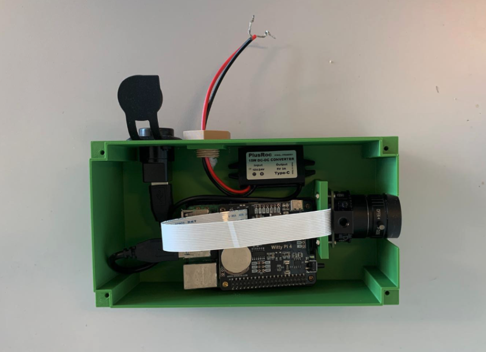
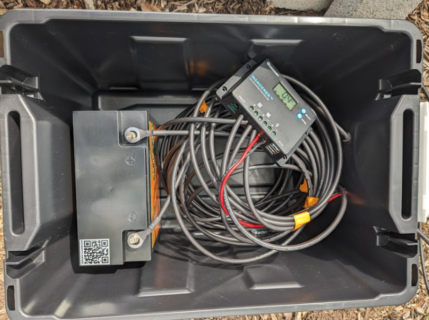
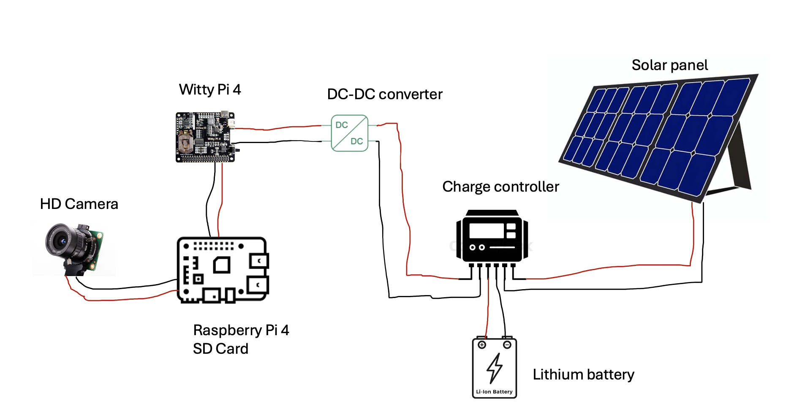

# BeeMonitor Hardware Guide

**Complete assembly and deployment instructions for the BeeMonitor video recording system**

## Table of Contents

1. [Overview](#overview)
2. [System Architecture](#system-architecture)
3. [Bill of Materials](#bill-of-materials)
4. [3D Printed Enclosure](#3d-printed-enclosure)
5. [Assembly Instructions](#assembly-instructions)
6. [Software Installation](#software-installation)
7. [WittyPi Setup](#step-8-set-up-wittypi)
8. [VNC Setup](#step-9-set-up-vnc-remote-desktop)
9. [WiFi Access Point Setup](#step-10-set-up-wifi-access-point)
10. [Field Deployment](#field-deployment)
11. [Maintenance](#maintenance)
12. [Troubleshooting](#troubleshooting)

## Overview

The BeeMonitor hardware system consists of two independent modules:

1. **Video Recording Module** (~$350 USD) — Raspberry Pi-based system for continuous video recording



2. **Energy Module** (~$245 USD) — Solar panel and battery for off-grid deployment



The recording module can operate standalone with grid power, or combined with the energy module for remote field sites.

**Total System Cost: $595 USD**


## System Architecture




## Bill of Materials

### Video Recording Module

| Component | Specification | Est. Price (USD) | Supplier |
|-----------|---------------|------------------|----------|
| Raspberry Pi 4 Model B | 4GB RAM | $70 | [Amazon](https://www.amazon.com/gp/product/B07TC2BK1X/ref=ox_sc_act_title_21) |
| Witty Pi 4 | Power management & RTC | $40 | [Adafruit](https://www.adafruit.com/product/5704?gad_source=1&gclid=CjwKCAjw_LOwBhBFEiwAmSEQASJOcA2QVEtrBkJMBaF8xFwxfno8XAqbypi9hw6s3qwa3Ln1Njmb4hoCvVMQAvD_BwE) |
| Raspberry Pi HQ Camera | IMX477, 12.3MP | $75 | [Amazon](https://www.amazon.com/Raspberry-Pi-Camera-Sensitivity-Alternative/dp/B08LHJR3K4/ref=sr_1_3?crid=11BWYCYQTDCZW&dib=eyJ2IjoiMSJ9.QwyDKWYwZ_FkTH3vkvv00UFR0v1NSGQ-pLOf3Oo_8oEYvU79_8s7gFAT8hPF3Tdk3DgH9Z096msrGQCmM9Yedf1P2aUMkT19e1EH7eccBb-9dZSQ6FGcy6r4G7xXRJyBi2rEZ9HeLG5K7SaUGtNdFjXY8icSmy2Hbqm2W3EazCY_xTj3E0BA98ETOHHaYlney0e2VpfLulsqUNccs7pEUEpOAkyfKldocsFUHK08SFI.MYIJShfswLYUqeiVWdK6rJZj86uv0XxzZyB31rQBQOI&dib_tag=se&keywords=HD+camera+for+raspberry+pi&qid=1710100897&sprefix=hd+camera+for+raspberry+pi%2Caps%2C98&sr=8-3) |
| CS-Mount Lens | 6mm focal length | $25 | [Amazon](https://www.amazon.com/Arducam-Raspberry-CS-Mount-Adjustable-Aperture/dp/B088GWZPL1/ref=pd_bxgy_d_sccl_1/135-4369406-5324613?pd_rd_w=uapNQ&content-id=amzn1.sym.2b132e63-5dcd-4ba1-be9f-9e044543d59f&pf_rd_p=2b132e63-5dcd-4ba1-be9f-9e044543d59f&pf_rd_r=H4QG7YB4PB6QYMBH9S70&pd_rd_wg=ZLzQu&pd_rd_r=25aeacc9-5e85-4f91-810f-4e735d169f89&pd_rd_i=B088GWZPL1&psc=1) |
| MicroSD Card | 256GB | $30 | [Amazon](https://www.amazon.com/SanDisk-256GB-Extreme-microSD-Adapter/dp/B07FCR3316/ref=sr_1_18?crid=1JZQLL34SSAJZ&dib=eyJ2IjoiMSJ9.qg2wNyziPjEqStb07QLG45zx-FVFHBC8GME7mvX9HR3OiCIaSXAw07xwu08FEb_nNUAq5lbFbkd1zs_1S1XNJr72pKPaq5Xum029mgRs3YPolb8HZfLrmZfchea0KMfUFImpeKvg6KzsKS-RdR4QjDMjA2QoctnX8BzlWJcIfHTcAB9Qfr_WWwaYDRB-Jjodqi3DcoqSKcVF4Ag7yyEvEGSo64OxqsODW6sUTNES8rYH77rMK6OQW9QTx_fYTn-g2HrPGQ1olTtIW5zolFfA5aXfRysJOFH19iWHsYyu7jM.gvQojHrIjCQfOKQhtke7Bx0zBZsk-Js78Lfbd6GfWrU&dib_tag=se&keywords=sd%2Bcard&qid=1714412070&s=electronics&sprefix=SD%2Celectronics%2C92&sr=1-18&th=1) |
| DC-DC Buck Converter | 12V to 5V, 3A min | $10 | [Amazon](https://www.amazon.com/dp/B09DGDQ48H/ref=sspa_dk_detail_2?pd_rd_i=B09DGFR24W&pd_rd_w=T6wo9&content-id=amzn1.sym.386c274b-4bfe-4421-9052-a1a56db557ab&pf_rd_p=386c274b-4bfe-4421-9052-a1a56db557ab&pf_rd_r=Z5H018PQ379NKB85MGSM&pd_rd_wg=uPn0L&pd_rd_r=d4455b8a-da5d-47b0-a462-78c67b0ded54&s=electronics&sp_csd=d2lkZ2V0TmFtZT1zcF9kZXRhaWxfdGhlbWF0aWM&th=1) |
| Waterproof USB Connector | Panel mount USB-C | $10 | [Amazon](https://www.amazon.com/dp/B091TMHVSS/ref=sspa_dk_detail_1?pd_rd_i=B091TMHVSS&pd_rd_w=yF3Od&content-id=amzn1.sym.386c274b-4bfe-4421-9052-a1a56db557ab&pf_rd_p=386c274b-4bfe-4421-9052-a1a56db557ab&pf_rd_r=GAWNCGR78GAEGBN2P8AG&pd_rd_wg=fMwbk&pd_rd_r=c61b544e-fa6f-4fc0-a4f6-baa11e678a21&s=electronics&sp_csd=d2lkZ2V0TmFtZT1zcF9kZXRhaWxfdGhlbWF0aWM&th=1) |
| Male A to Male A | USB | $10 | [Amazon](https://www.amazon.com/Your-Cable-Store-USB-Cables/dp/B07BZ2M3WM/ref=sr_1_4?crid=34TPGV497YJZB&dib=eyJ2IjoiMSJ9.0uqtYuGtdSIKXM0N_5DeiR_RavNVA9MToj1VRBd6exHlvNqojLA2eTELLtyAZuCCQNbdwg4fdkCIk5C2KPmmhuE74yCbs6WrOJVRjE1YlryB92ksQt7PKXpEB2cWmqfRvBXFuGniyQpI54h8UIhqcRs2k2nVoWiRvo7eEet0HeBaqRl-IjYiq6Nd6BoCUqTdJbRo3gfdyhA-L2zmBA97uB4AmPm64U00WXhFG5l1V0uGqekhfIUDhoBHRcJb0HBEqyO8fJ2I1ffFywEUKzg0V4Pv290iyLOyee-mJqX3rHM.k0NOeN_5xxS_wkdmG4Wz1eVhe994sC9QT1OPo8KMhcU&dib_tag=se&keywords=usb%2Bto%2Busb%2Bshort&qid=1708566655&s=electronics&sprefix=usb%2Bto%2Busb%2Bshort%2Celectronics%2C112&sr=1-4&th=1) |
| 3D Printed Enclosure | PETG recommended | $50 | Self-print or service |
| Camera Tripod | 50-inch portable | $20 | [Amazon](https://www.amazon.com/dp/B00XI87KV8?ref_=cm_sw_r_apan_dp_KDSDE4XYJGSKXYBDA4A4&language=en-US&th=1) |
| Mounting Hardware | M2.5 standoffs, screws, cable glands | $10 | [Amazon](https://www.amazon.com/iUniker-Raspberry-Standoffs-Spacers-Standoff/dp/B0F6MNBQVL/ref=sr_1_1_sspa?dib=eyJ2IjoiMSJ9.R1Y_pSmTsEnF_05yeQt1b0Cosr-xaJQUdix8ximCQWt15Ups-IOyLmjXx8enOAQkz698By1tNK9ZqzE0YB3fp57vkrhey_2U-jLtZyz6e8vRmTNLPpb_hk7bsNcRwBRoHd5pcqROMpt9pk2OUFHUYAPeuT3Wp7sjASDGwtVTa11R8NfpazntKmgVModWjjgd0qkBlER9Ogrx5nDPTWq8ScDG4XfLq1ZAmpzOiH94ok4.Nyid2rA0qLSC6bsZwS6xu2o6kh6tvJSfb6KlWw8MKUo&dib_tag=se&keywords=M2.5+standoffs&qid=1769380197&sr=8-1-spons&sp_csd=d2lkZ2V0TmFtZT1zcF9hdGY&psc=1) |

**Subtotal: $350 USD**

### Energy Module (Off-Grid)

| Component | Specification | Est. Price (USD) | Supplier |
|-----------|---------------|------------------|----------|
| Solar Panel | Renogy 100W 12V Solar Panel Starter Kit | $120 | [Amazon](https://www.amazon.com/Renogy-Monocrystalline-Negative-Controller-Connectors/dp/B00BFCNFRM/ref=dp_prsubs_d_sccl_1/144-8060600-4556963?pd_rd_w=LNQsf&content-id=amzn1.sym.8a163a7b-6a2a-45ae-8510-8d5419efb828&pf_rd_p=8a163a7b-6a2a-45ae-8510-8d5419efb828&pf_rd_r=QTQB0ZAXC4F2T5D6ECZV&pd_rd_wg=CGslW&pd_rd_r=dcc3fe90-f2d6-47d5-a551-b932c0671273&pd_rd_i=B00BFCNFRM&th=1) |
| Battery | 12V 30Ah LiFePO4 | $80 | [Amazon](https://www.amazon.com/dp/B09N9BBS68?ref=emc_p_m_5_i_atc&th=1) |
| Battery Enclosure | Waterproof toolbox | $30 | Hardware store |
| Wires | 16 Gauge Wire  | $15 | [Amazon](https://www.amazon.com/TYUMEN-Electrical-Extension-Flexible-Lighting/dp/B07SG23DT1/ref=sr_1_7?crid=10Q62QUB3LV1N&dib=eyJ2IjoiMSJ9.2iXpWNmEaXXfEOKOyz1qrFlHNJPZiPifVazRkDqYa9Vn6N5IUlzXqqmqfyOPPo4GFxNu9KianaH90wHJ-Htq-QmldRT9wn8FVIMzsPPA7WpXP46fbmlhNX7TGpLheil-lBsrJcNDWcbBWulf-FX0d-kzHTLT9Yp7JgryuVrfBUMgk9KMo661i7HSCBdA198hOtk6UyPNK58A3lz7U72_-iAve4rZCmMVNGJ2sqIChqJwjBf6BC8QEEQe5VOL4DiZPc6SUyAfira_gP_XTzAKnfn9FGJs8-jcbCplaZ8VPqY.PJfGj73KdDWQ8B7rrVf6q7b17V9BjJ2ocOpDrv-Grpw&dib_tag=se&keywords=12v%2Bcables&qid=1712062868&sprefix=12v%2Bcables%2Caps%2C69&sr=8-7&th=1) |

**Subtotal: $245 USD**

## 3D Printed Enclosure

### STL Files

Located in `/hardware/enclosure/`:

- `enclosure_body.stl` — Main housing (fits Pi + Witty Pi + converter)
- `enclosure_lid.stl` — Removable lid with camera mount hole
- `enclosure_tripod_connector.stl` — Adjustable bracket for HQ camera
- `power_cable_connector.stl` — Adapter for waterproof cable entry

### Print Settings

| Setting | Recommendation |
|---------|----------------|
| **Material** | PETG (UV resistant) or PLA |
| **Layer Height** | 0.2mm |
| **Infill** | 20% |
| **Walls** | 3 perimeters |
| **Supports** | Yes |
| **Bed Adhesion** | Brim recommended |

**Print Time:** ~8–12 hours total

### Weatherproofing

1. Apply silicone sealant around all cable entry points
2. Apply conformal coating to exposed PCB edges (optional)
3. Ensure cable glands are properly tightened

## Assembly Instructions

### Electronics Assembly

1. **Install Raspberry Pi** to enclosure 
2. **Stack Witty Pi 4** on GPIO header (align carefully)
3. **Connect HQ Camera** ribbon cable to CSI port
4. **Mount camera** in lid bracket
5. **Install DC-DC converter** in the enclosure 
6. **Wire DC-DC output** (5V) to Witty Pi power input
7. **Route power cable** through cable gland (ensure weatherproof)
8. **Test fit lid** (don't seal yet until software is configured)

### Energy Module Assembly

**Connection Sequence (IMPORTANT):**
1. Connect battery to controller FIRST (BAT terminals)
2. Connect solar panel to controller (PV terminals)
3. Connect load output to recording module DC-DC input

**Warning:** Always connect battery BEFORE solar panel to prevent controller damage.

## Software Installation

### Step 1: Download Source Code

```bash
cd ~/Desktop
git clone https://github.com/eai6/BeeHotelMonitoring.git
cd BeeHotelMonitoring/beeHotelCode
```

### Step 2: Install Dependencies

#### 2.1 Update and Upgrade
```bash
sudo apt update
sudo apt upgrade
```

#### 2.2 Install picamera
```bash
sudo apt install -y python3-picamera2
```

#### 2.3 Install opencv
```bash
sudo apt install python3-opencv
```

### Step 3: Create Program Directories

```bash
python3 makeDirectories.py
```

### Step 4: Focus Camera

```bash
python3 runFocus.py
```

**Note:** Make sure the camera was connected when you turn on the Raspberry Pi. If it was not connected on boot, then you should reboot the system:

```bash
sudo reboot
```

### Step 5: Set Up Recording Service

#### 5.1 Create Service File
```bash
sudo nano /lib/systemd/system/beeHotelRecord.service 
```

#### 5.2 Paste the Following Configuration
```ini
[Unit]
Description=beeHotel
After=multi-user.target

[Service]
Type=idle
ExecStart=/usr/bin/python /home/apis/Desktop/BeeHotelMonitoring/beeHotelCode/driver.py
Restart=always

[Install]
WantedBy=multi-user.target
```

#### 5.3 Update Daemon
```bash
sudo systemctl daemon-reload
```

### Step 6: Test Recording Service

#### 6.1 Start the Service
```bash
sudo systemctl start beeHotelRecord.service
```

#### 6.2 Check Status
```bash
sudo systemctl status beeHotelRecord.service
```

#### 6.3 Stop Service (if needed)
```bash
sudo systemctl stop beeHotelRecord.service
```

### Step 7: Enable Service on Boot

```bash
sudo systemctl enable beeHotelRecord.service
```

---

## Step 8: Set Up WittyPi

### 8.1 Download and Install WittyPi
```bash
cd ~/Desktop
wget http://uugear.com/repo/WittyPi4/install.sh
sudo sh install.sh
```

### 8.2 Set Recording to Launch at Startup
```bash
nano /home/apis/Desktop/wittypi/afterStartup.sh 
```

Add the following line:
```bash
sudo python /home/apis/Desktop/BeeHotelMonitoring/beeHotelCode/driver.py
```

### 8.3 Enable I2C
```bash
sudo raspi-config
```
Navigate to: **Interface Options → I5 I2C → YES → OK**

### 8.4 Test WittyPi Through 1 Cycle

Open terminal:
```bash
cd ~/Desktop/wittypi/
sudo ./wittyPi.sh
```

**Configuration steps:**

1. Select **(1)** to write system time to RTC on the WittyPi
   - (Assumes the time on the Raspberry Pi is accurate and the time on the RTC is not)
   - If it is the other way around, select **(2)** instead

2. **Schedule next startup (4):** Set to something relatively soon, like `?? ??:01:00` (one minute past the next hour — change the minute to something reasonable)

3. **Schedule next shutdown (5):** Set to 60 seconds before the startup, like `?? ??:00:00` (at the next hour)

4. Wait for Pi to shutdown and restart 60 seconds later to verify the cycle works

### 8.5 Create Production Schedule

Create the scheduler file:
```bash
sudo nano /home/apis/Desktop/wittypi/schedules/beeHotelScheduler_2024.wpi
```

Paste the following:
```
BEGIN 2024-03-00 07:50:00
END   2024-09-01 00:00:00
ON    H10 M15 # will start recording from 7:50am to 6:05pm
OFF   H13 M45 # will be off until the next day
```

### 8.6 Apply the Schedule

```bash
cd ~/Desktop/wittypi/
sudo ./wittyPi.sh
```

1. Choose **schedule script (6)**
2. Pick the `beeHotelScheduler_2024.wpi` script
3. Verify that the next power on/off times make sense

## Step 9: Set Up VNC (Remote Desktop)

### 9.1 Enable VNC
```bash
sudo raspi-config
```
Navigate to: **Interfacing Options → VNC → Enable**

### 9.2 Configure VNC

1. Enter email and password
2. Allow cloud and direct connection
3. Authenticate with Unix password
4. Encryption with at least 128-bit
5. Allow all users

## Step 10: Set Up WiFi Access Point

This allows you to connect to the Pi in the field without an internet connection.

### 10.1 Install Required Packages
```bash
sudo apt install dnsmasq hostapd
```

### 10.2 Stop Services Until Configuration is Complete
```bash
sudo systemctl stop dnsmasq
sudo systemctl stop hostapd
```

### 10.3 Configure Static IP
```bash
sudo nano /etc/dhcpcd.conf
```

Add the following at the bottom of the file:
```
# Wifi Access Point Config
interface wlan0
static ip_address=192.168.0.10/24
nohook wpa_supplicant
```

### 10.4 Restart DHCP Service
```bash
sudo service dhcpcd restart
```

### 10.5 Configure DHCP Server
```bash
sudo mv /etc/dnsmasq.conf /etc/dnsmasq.conf.orig
sudo nano /etc/dnsmasq.conf
```

Add the following:
```
interface=wlan0
dhcp-range=192.168.0.11,192.168.0.30,255.255.255.0,24h
```

### 10.6 Configure Access Point Host Software
```bash
sudo nano /etc/hostapd/hostapd.conf
```

Add the following (**change `YOURSSID` and `YOURPWD` to your desired network name and password**):
```
country_code=US
interface=wlan0
ssid=YOURSSID
channel=9
auth_algs=1
wpa=2
wpa_passphrase=YOURPWD
wpa_key_mgmt=WPA-PSK
wpa_pairwise=TKIP CCMP
rsn_pairwise=CCMP
```

### 10.7 Point to Configuration File
```bash
sudo nano /etc/default/hostapd
```

Find the line with `#DAEMON_CONF` and replace it with:
```
DAEMON_CONF="/etc/hostapd/hostapd.conf"
```

### 10.8 Start the Access Point
```bash
sudo systemctl unmask hostapd
sudo systemctl enable hostapd
sudo systemctl start hostapd
```

---

## Managing the Access Point

### Disable Access Point
```bash
sudo systemctl disable hostapd dnsmasq
```

Comment out the static IP config:
```bash
sudo nano /etc/dhcpcd.conf
```
(Add `#` before each line in the WiFi Access Point Config section)

Reboot:
```bash
sudo reboot
```

### Enable Access Point
```bash
sudo systemctl enable hostapd dnsmasq
```

Uncomment the static IP config:
```bash
sudo nano /etc/dhcpcd.conf
```
(Remove `#` from each line in the WiFi Access Point Config section)

Reboot:
```bash
sudo reboot
```

## Field Deployment

### Site Selection

- **Distance:** Camera 0.5–1.0m from bee hotel
- **Angle:** Perpendicular to hotel face (minimize skew)
- **Lighting:** Avoid direct sun on lens (causes glare)
- **Stability:** Secure mounting to prevent vibration


### Data Transfer

There are two methods to transfer video files from the Raspberry Pi:

#### Method 1: Direct SSH (SCP)

Transfer files directly from the Raspberry Pi to your computer over SSH after connecting to the Raspberry Pi access point.

1. **Connect to Raspberry Pi access point**
   - WiFi name: `BeeMonitor`
   - Password: `Osmia@2024`

2. **SSH into the Raspberry Pi**
   ```bash
   ssh apis@192.168.0.10
   ```
   - Password: `honeybee` or `Osmia@2024`

3. **Find the file path**
   ```bash
   # Navigate to video folder
   cd /home/apis/Desktop/cameraOutput/beeHotel/
   
   # List files with details
   ls -la
   
   # Get current path
   pwd
   ```
   Files will be at paths like: `/home/apis/Desktop/cameraOutput/beeHotel/2024-09-17_13_50_01.mp4`

4. **Transfer file to your computer**
   
   Open a **new terminal on your computer** (in the folder where you want to save files):
   ```bash
   scp apis@192.168.0.10:/home/apis/Desktop/cameraOutput/beeHotel/2024-09-17_13_50_01.mp4 .
   ```

   Transfer entire folder:
   ```bash
   scp -r apis@192.168.0.10:/home/apis/Desktop/cameraOutput/beeHotel/2024-09-17/ .
   ```

#### Method 2: USB Flash Drive

Use the VNC remote desktop to navigate and transfer files graphically.

1. **Connect to Raspberry Pi access point**
   - WiFi name: `BeeMonitor`
   - Password: `Osmia@2024`

2. **Open VNC Viewer** on your computer and connect to `192.168.0.10`

3. **Insert USB flash drive** into the Pi

4. **Use the File Manager** (graphical interface) to:
   - Navigate to `/home/apis/Desktop/cameraOutput/beeHotel/`
   - Select files/folders to copy
   - Navigate to the USB drive in `/media/apis/`
   - Paste files

5. **Right-click the USB drive icon** and select "Eject" before removing

## Maintenance

### Daily Checks

- [ ] Verify recording service running (`sudo systemctl status beeHotelRecord.service`)
- [ ] Check storage usage (`df -h`)
- [ ] Download new videos 
- [ ] Clean camera lens 
- [ ] Check battery voltage

### Weekly Checks

- [ ] Inspect enclosure seals
- [ ] Check cable connections
- [ ] Clean solar panel
- [ ] Verify RTC accuracy
- [ ] Delete transfered videos

## Troubleshooting

| Issue | Solution |
|-------|----------|
| Camera not detected | Check ribbon cable, reboot if camera wasn't connected at boot |
| Service not starting | Check `sudo systemctl status beeHotelRecord.service` for errors |
| WittyPi not detected | Run `i2cdetect -y 1`, should show device at 0x08 |
| Storage full | Delete transfered videos |
| WiFi AP not working | Verify hostapd config, check `sudo systemctl status hostapd` |
| Wrong time on recordings | Sync RTC time via `wittyPi.sh` option (1) or (2) |

### Diagnostic Commands

```bash
# Check camera
libcamera-hello --list-cameras

# Check storage
df -h

# Check I2C (WittyPi)
i2cdetect -y 1

# Check service status
sudo systemctl status beeHotelRecord.service

# View service logs
journalctl -u beeHotelRecord.service -f
```

## Support

- **Author:** Edward Amoah
- **Email:** eai6@psu.edu
- **Lab:** [Grozinger Lab](https://www.grozingerlab.com/), INSECT-NET, Penn State University