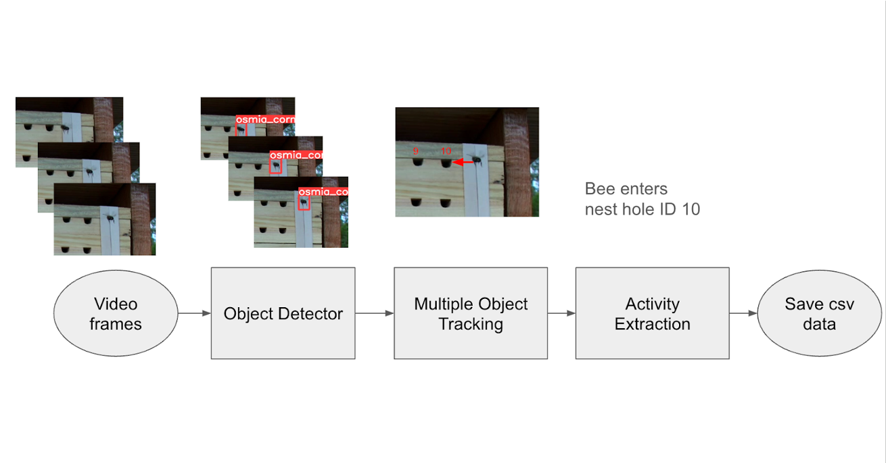

# BeeMonitor Source Code

**Core analysis engine for automated bee monitoring**

Version 1.0.0


## Overview

The BeeMonitor package implements a modular computer vision pipeline for detecting and tracking bee activity in bee hotel videos. The architecture separates detection (finding objects in frames), tracking (following objects over time), event processing (identifying biological behaviors), and output generation.



## Package Structure

```
beemonitor/src
├── __init__.py
├── core/
│   ├── config.py              # Configuration management
│   ├── video_analyzer.py      # Main BeeMonitor class
│   └── analysis_results.py    # Result containers
├── detection/
│   ├── yolo_detector.py       # YOLO26 wrapper (NMS-free end-to-end)
│   ├── blob_detector.py       # Motion detection (two-mode)
│   ├── nest_detector.py       # Nest grid detection
│   └── noise_filter.py        # Detection filtering
├── tracking/
│   ├── bee_tracking.py        # BeeTracking orchestrator
│   └── mot/
│       ├── bee_tracker.py     # BeeTrack MOT algorithm
│       └── base_mot.py        # Abstract tracker interface
├── processing/
│   ├── event_processor.py     # ML-first event detection
│   ├── event_classifier.py    # Random Forest classifier
│   ├── trajectory_analyzer.py # Trajectory feature extraction
│   └── interaction_analyzer.py
├── output/
│   ├── csv_generator.py       # CSV export
│   └── video_synthesizer.py   # Annotated video output
├── utils/
│   └── geometry.py            # Spatial utilities
└── visualization/
    └── detection_source_visualizer.py
```

## Module Descriptions

### core/ - Pipeline Orchestration

**Main Files:**
- `video_analyzer.py` - Complete analysis pipeline (`BeeMonitor` class)
- `config.py` - Configuration management (`Config` class)
- `analysis_results.py` - Results data structures (`AnalysisResults`)

**Purpose:** High-level API for end-to-end video analysis. Coordinates all modules.

**Pipeline Flow:**
1. Initialize detectors (Blob & YOLO)
2. Initialize tracking system
3. Process frames → detections → tracks
4. Extract events from tracks
5. Generate outputs

### detection/ - Object Detection

**Main Files:**
- `base_detector.py` - Abstract detector interface (`BaseDetector`, `Detection`)
- `blob_detector.py` - Motion-based detection (`BlobDetector`)
- `yolo_detector.py` - Deep learning detection (`YOLODetector`)
- `nest_detector.py` - Nest tube localization (`NestDetector`)

**Purpose:** Multiple detection methods for different scenarios (moving/stationary bees).

### tracking/ - Multi-Object Tracking

**Main Files:**
- `base_tracking.py` - Abstract tracking interface (`BaseTracking`)
- `bee_tracking.py` - Bee hotel tracking orchestrator (`BeeTracking`)
- `mot/base_mot.py` - Abstract MOT interface (`BaseMOT`)
- `mot/bee_tracker.py` - Custom Kalman tracker (`BeeTracker`)
- `mot/ultralytics_tracker.py` - ByteTrack/BoT-SORT wrapper (`UltralyticsTracker`)

**Purpose:** Two-layer architecture for flexible tracking.

**Architecture:**

```
Layer 1: High-Level Tracking (BeeTracking)
  ├─ Manages detection pipeline
  ├─ Coordinates multiple detectors
  ├─ Feeds detections to MOT
  └─ Domain-specific logic
           ↓
Layer 2: MOT Algorithm (BeeTracker / ByteTrack)
  ├─ Track-detection association
  ├─ State prediction (Kalman)
  ├─ Track lifecycle management
  └─ ID consistency
```

### processing/ - Event Analysis

**Main Files:**
- `event_processor.py` - Entry/exit event extraction (`EventProcessor`)
- `event_classifier.py` - ML-based event classification (`EventClassifier`)
- `trajectory_analyzer.py` - Movement pattern analysis (`TrajectoryAnalyzer`)
- `interaction_analyzer.py` - Bee interaction detection (`InteractionAnalyzer`)

**Purpose:** Extract biological behaviors from tracking data.

### output/ - Results Export

**Main Files:**
- `csv_generator.py` - CSV export functionality (`CSVGenerator`)
- `video_synthesizer.py` - Annotated video generation (`VideoSynthesizer`)

**Purpose:** Generate analysis outputs in various formats.

### utils/ - Shared Utilities

**Main Files:**
- `geometry.py` - Geometric computations

**Purpose:** Common utilities used across modules.

**Functions:**
- Bounding box operations (IoU, NMS, area)
- Coordinate transformations
- Distance calculations
- Polygon operations

## Data Flow

```
Input Video
    ↓
[DETECTION MODULE]
    ├─ BlobDetector → motion detection
    └─ YOLODetector → bee tracking
    ↓
List[Detection]
    ↓
[TRACKING MODULE]
    ├─ BeeTracking orchestrates detections
    └─ MOT algorithm (BeeTracker) associates & tracks
    ↓
Dict[track_id, Track]
    ↓
[PROCESSING MODULE]
    ├─ EventProcessor → entry/exit events
    └─EventClassifier → ML filtering
    ↓
Events + Metrics
    ↓
[OUTPUT MODULE]
    ├─ CSVGenerator → CSV files
    └─ VideoSynthesizer → annotated video
    ↓
Analysis Results
```

## Configuration

The system uses configuration py files inside core

## Dependencies

**Core:**
- opencv-python >= 4.8.0
- numpy >= 1.24.0
- pandas >= 2.0.0
- ultralytics >= 8.0.0 (YOLOv8)
- scipy >= 1.11.0
- scikit-learn >= 1.3.0

**Optional:**
- torch >= 2.0.0 (GPU acceleration)
- tensorrt (NVIDIA GPU optimization)

## Architecture Principles

### Modularity
Each module has a clear responsibility and can be used independently.

### Extensibility
New detectors and trackers can be added by implementing base classes:
```python
class CustomDetector(BaseDetector):
    def detect(self, frame):
        # Your implementation
        return detections

class CustomMOT(BaseMOT):
    def update(self, detections, frame_num):
        # Your implementation
        return tracks
```

### Performance
- Optimized for laptop hardware (M3 Pro achieves near real-time)
- Adaptive algorithms reduce computation
- Parallel processing support

### Accuracy
- Multiple detection methods catch different scenarios
- ML-based noise filtering reduces false positives
- Custom tracking handles fast bee movements


## Support

- **Author:** Edward Amoah
- **Email:** eai6@psu.edu
- **Lab:** [Grozinger Lab](https://www.grozingerlab.com/), INSECT-NET, Penn State University
